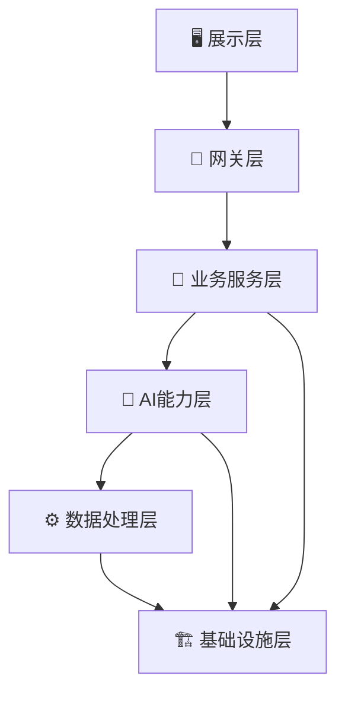
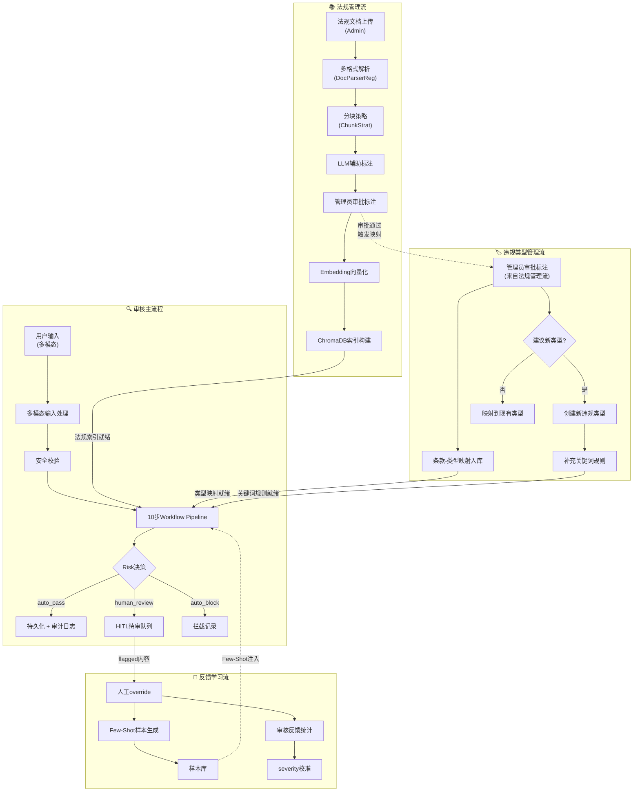
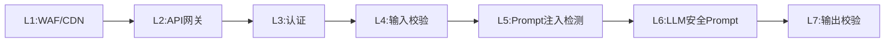
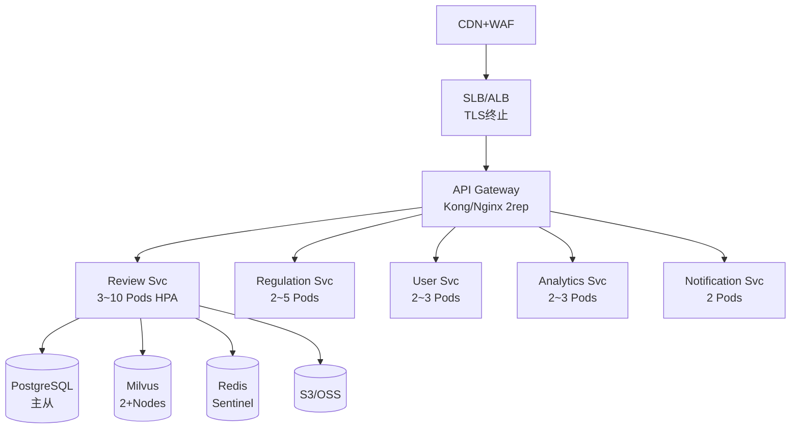
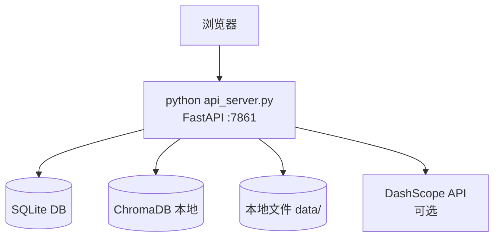

# 保险营销内容智能审核系统 — 统一架构文档

> 版本: v1.1 | 更新日期: 2026-05-18 | 受众: 架构师、技术负责人、新成员 onboarding

---

## 一、系统定位

基于 LLM + RAG 的金融保险营销内容合规审核系统，采用 **Rule-First + Workflow** 架构。规则引擎做关键词预检，LLM 始终执行完整语义审核，两者结果合并输出。10 步流水线驱动审核，Risk Engine 评分决定三级处置（auto_pass / human_review / auto_block）。系统支持多格式法规文档摄入、多模态用户输入、HITL 人机协同与 Few-Shot 反馈学习。

---

## 二、核心架构 — 六层解耦

| 层 | 生产 | Demo 简化 |
|----|------|-----------|
| **展示层** | React SPA + CDN 分发 | FastAPI + 纯 HTML |
| **网关层** | Kong/Nginx：JWT+RBAC、滑动窗口限流、CORS、WAF、熔断 | SecurityMiddleware：内存限流(60次/60s)、33种安全检测(25注入+5XSS+3SQLi)、无 WAF |
| **业务服务层** | 5 个微服务(Review/Regulation/User/Analytics/Notification) + Celery 异步 | 单进程 FastAPI，同步阻塞 |
| **AI 能力层** | WorkflowEngine + LLM Gateway(多模型路由+熔断) + RAG(BM25+向量混合) + Cross-Encoder Reranker + Risk Engine | 同架构但：单模型直连、CrossCheck 可跳过 |
| **数据处理层** | DocParserReg + InputProcChn + ChunkStrat(4策略) | 相同，但无长文本分段审核、无复杂表格处理 |
| **基础设施层** | PostgreSQL+Redis+Milvus+S3/OSS+KMS+Prometheus+Grafana+Loki+Jaeger | SQLite(WAL)+ChromaDB(本地)+本地文件系统+.env+可选 Prometheus |

---

## 三、审核管线 — 10 步流水线

| 步骤 | 职责 | 生产 | Demo 简化 |
|------|------|------|-----------|
| ① Extract | 要素提取 | Qwen(可配置，默认qwen3.6-plus) | 相同；API Key 缺失时降级为关键词提取 |
| ② RuleCheck | 关键词预检 | 规则引擎(6类违规) | 相同 |
| ③ RAGRetrieve | 法规检索 | Milvus 向量 + BM25 混合检索，Top20 | ChromaDB 向量 + 关键词，Top20；无 BM25 |
| ④ Rerank | 重排序 | Cross-Encoder(qwen3-rerank)语义精排 → Top5+相邻 | 有Key用Cross-Encoder，无Key降级规则重排(字符重叠+关键词加权) |
| ⑤ ExpandRelations | 条款关联扩展 | 法规知识图谱+多级关联 | 1级条款引用跟随，不递归 |
| ⑥ LLMReason | CoT 推理 | Qwen + Few-Shot + rule_hint | 相同；API Key 缺失时降级为 rule-engine |
| ⑦ Format | 结构化归一化 | LLM 结果为主体 + 规则参考注入 + 降级兜底 | 相同 |
| ⑧ Validate | 幻觉检测 | 引用条文与法规库交叉验证 | 相同 |
| ⑨ CrossCheck | 交叉复核 | 同级模型复核 + Self-Consistency + 规则校验 | API Key 缺失时直接跳过 |
| ⑩ RiskAssess | 风险评分+决策 | severity×0.5 + 条文加权 + 规则加成 + 置信度调整 → 4级分类 → 3级决策 | 相同 |

**风险决策路由**：risk < 0.1 → auto_pass | 0.1 ≤ risk < 0.7 → human_review | risk ≥ 0.7 → auto_block

---

## 四、四条数据流主线

系统包含审核主流程、法规管理、反馈学习、违规类型管理四条数据流，相互关联构成完整业务闭环。

---

## 五、核心 Use Case

### UC1: 营销内容审核

业务人员提交营销文案 → 安全校验(33种安全检测) → 10步Pipeline → 风险评分 → 三级决策路由。示例："稳赚不赔，年化收益5%" → RuleCheck命中"绝对化用语" → 注入LLM Prompt继续检查 → LLM发现收益承诺+夸大收益 → Validate验证引用条文 → RiskAssess评分1.0 → auto_block。

### UC2: 法规文档入库

合规管理员上传法规PDF → DocParserReg解析 → ChunkStrat按条款分块 → LLM辅助标注行为模式 → 管理员审批 → Embedding向量化 → ChromaDB索引构建 → 审核管线可引用新法规。Demo：自动设生效日期；生产：手动设生效日期+条文diff+变更通知。

### UC3: 人工复核与反馈学习

审核员查看human_review待审队列 → 对照法规条文逐条审核 → override决策(通过/驳回+备注) → 系统自动生成Few-Shot样本 → 后续同类审核自动注入案例。生产：AI一键生成修改理由，减轻审核员负担。

### UC4: 违规类型管理

管理员查看违规类型列表 → 创建新类型/废弃旧类型/补充关键词 → 条款映射入库 → 规则引擎和LLM审核立即可用新类型。Demo：API Key缺失时禁止创建自定义类型；生产：创建→审批→生效工作流。

---

## 六、数据层对比

| 维度 | 生产 | Demo |
|------|------|------|
| **关系数据库** | PostgreSQL 15+，主从复制，连接池，分区表 | SQLite 单文件(WAL模式) |
| **向量库** | Milvus 2.x 分布式集群，持久化备份，HNSW 索引 | ChromaDB PersistentClient 本地持久化 |
| **缓存** | Redis Cluster (Sentinel哨兵)，L1进程内+L2分布式两级缓存 | 进程内 LRU 缓存(500条/30min) |
| **文件存储** | S3/OSS 对象存储，跨区域冗余 | 本地文件系统 data/ |
| **异步队列** | Celery + Redis，4~8 Workers | 同步阻塞，AsyncEngine(Semaphore) |
| **备份** | pg_dump + OSS 上传 + 跨区域，RPO 1h | 文件级拷贝，保留7份 |
| **数据保留** | 分区表+自动归档，365天在线+更早归档至OSS | 365天软删除 |
| **内容去重** | SHA256 content_hash + Milvus 标量索引 | 按文件名去重 |

---

## 七、安全架构 — 7 层纵深防御

| 层 | 职责 | 生产 | Demo |
|----|------|------|------|
| L1 WAF/CDN | 网络层防护 | ✅ 云WAF + CDN + DDoS防护 + IP黑名单 | ❌ 无 |
| L2 API网关 | 限流+CORS | ✅ 滑动窗口 + IP白名单 + CORS白名单 | ⚠️ 内存限流(60次/60s全局) |
| L3 认证 | 身份鉴权 | ✅ OAuth2.0 + JWT + RBAC矩阵 + API Key过期检查 | ⚠️ 单一admin角色，硬编码密码 |
| L4 输入校验 | 注入防护 | ✅ XSS(5种)/SQL注入(3种)/控制字符/输入长度限制 | ✅ 相同 |
| L5 Prompt注入检测 | 攻击识别 | ✅ 25种注入模式 + 持续更新 | ✅ 相同 |
| L6 LLM安全Prompt | 角色约束 | ✅ 角色约束 + JSON Schema + 敏感信息过滤 | ✅ 相同 |
| L7 输出校验 | 结果验证 | ✅ JSON Schema + 幻觉检测 + CrossCheck + 敏感信息脱敏 | ⚠️ CrossCheck 可跳过，无脱敏 |

**其他安全差异**：

| 维度 | 生产 | Demo |
|------|------|------|
| 传输加密 | TLS 1.3 全链路 HTTPS | 无 HTTPS |
| 密钥管理 | KMS/Vault，90天轮转 | .env 文件 |
| 审计日志 | DB追加写+HMAC签名，不可篡改 | JSONL文件+HMAC签名 |
| 数据加密 | PostgreSQL TDE + 字段加密(bcrypt/argon2) | 无 |

---

## 八、部署架构

### 生产：Kubernetes 多AZ集群

**SLA**：99.9% 可用性 | RPO 1h | RTO 15min | P95 < 3s | 100 reviews/min

### Demo：单机单进程

**资源**：2C4G / 20GB / Python 3.10+ | 无 SLA | 单用户

---

## 九、关键演进路线

| 优先级 | 内容 | 说明 |
|--------|------|------|
| **P0 上线前** | PostgreSQL 迁移 + Milvus 部署 + 多 Key 轮转 + 安全加固(TLS/OAuth2.0/KMS) + 监控部署(Prometheus+Grafana+Loki) + K8s 容器化 | 生产必需 |
| **P1 上线后1月** | 独立Reranker服务 + RBAC 细粒度增强 + HITL 专业工作台(React) + CrossCheck 增强(同级模型复核) + 法规管理增强(BM25混合检索) + 图文一致性校验 | 重要改进 |
| **P2 迭代优化** | SLM 语义规则引擎(FinBERT微调) + DAG 并行流水线(延迟优化) + 多模态独立审核 + 法规知识图谱 + Few-Shot 自动管理 + 上下文压缩(Prompt优化) + AI评估平台 + 模型漂移监控 + Policy DSL + 事件驱动架构(Kafka) + 多租户支持 | 长期演进 |
