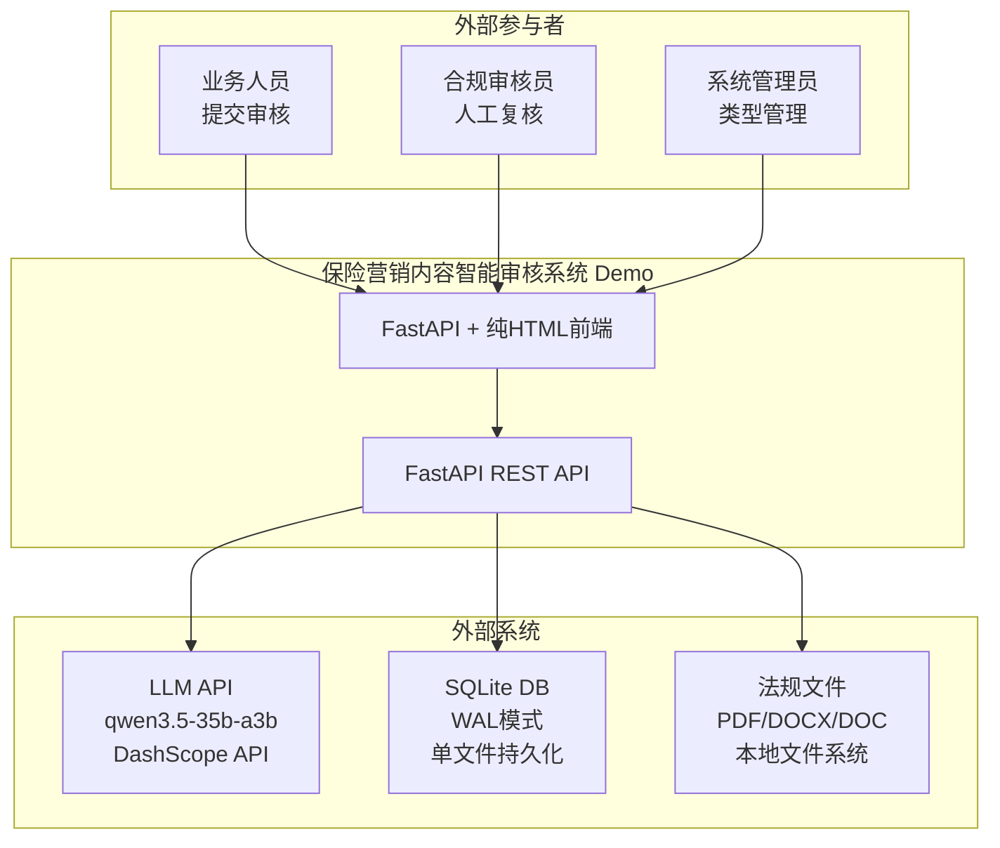
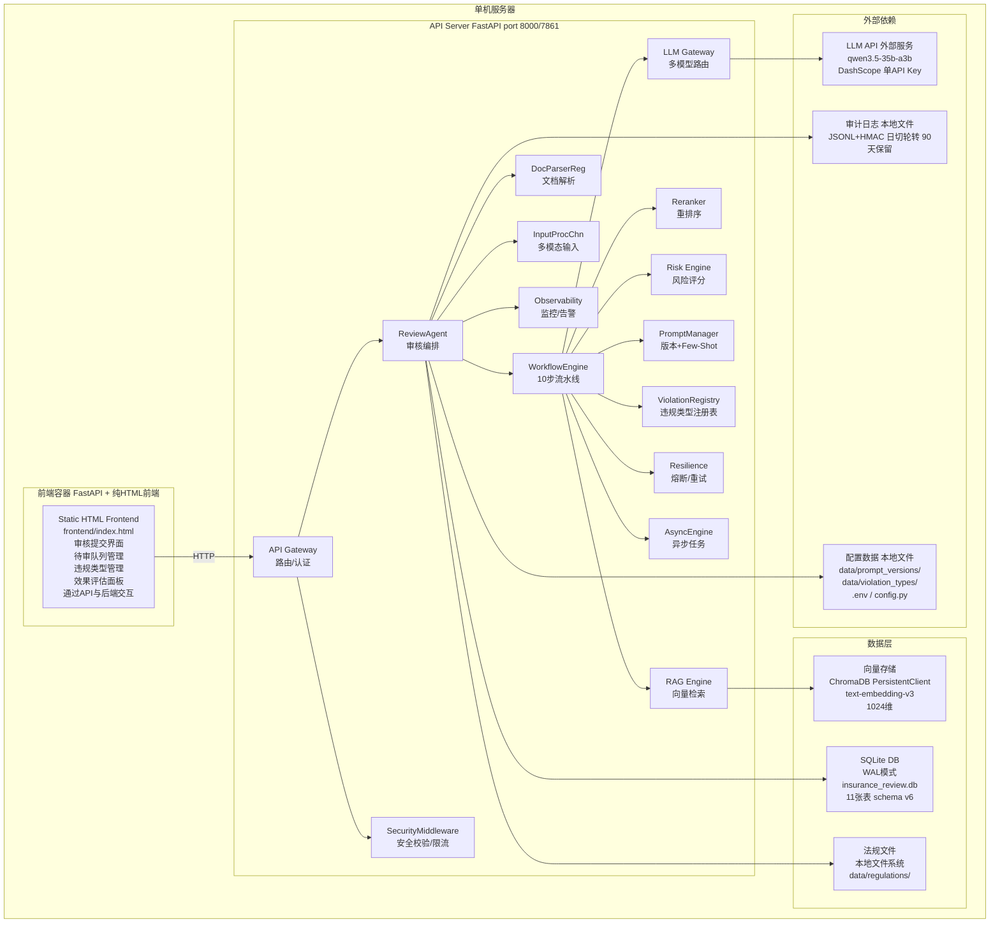
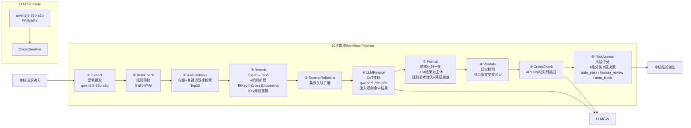
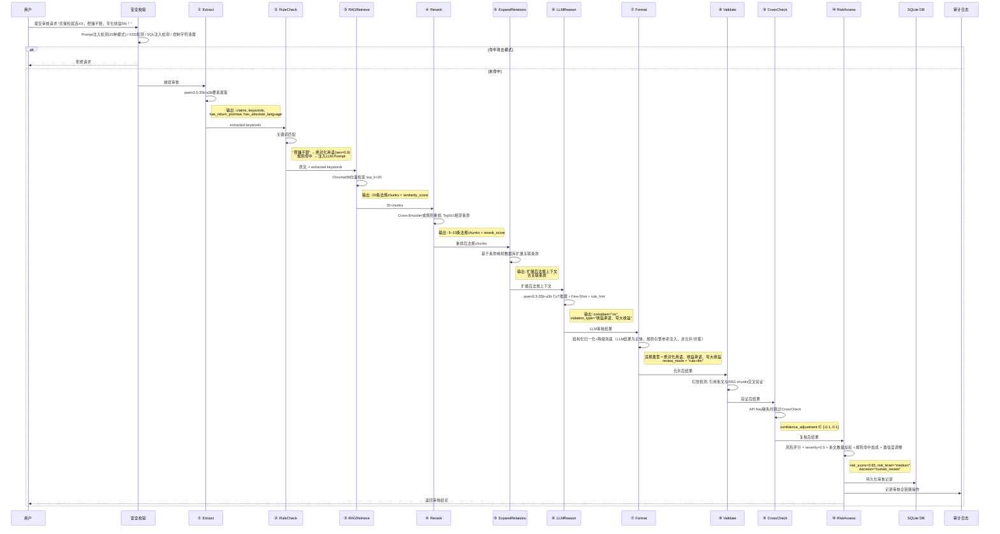
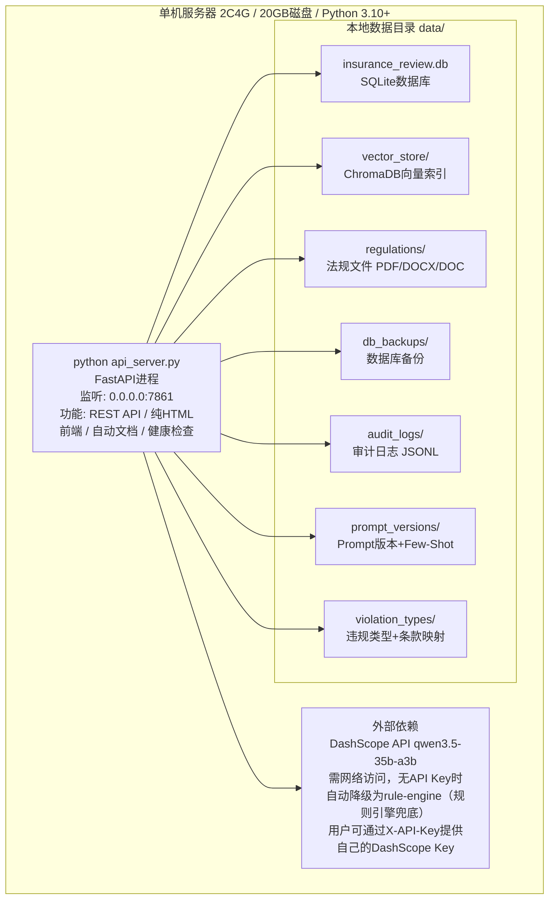

# 保险营销内容智能审核系统 — Demo架构设计

> 版本: v1.0 | 更新日期: 2026-05-16 16:18 | 受众: 架构师、开发团队、产品经理

---

## 一、文档说明

本文档描述保险营销内容智能审核系统 **Demo版本** 的完整架构设计。Demo版本以功能验证为核心目标，在数据存储、可靠性、安全性、可扩展性等方面做了大量简化，适用于产品演示、功能验证和开发调试场景。

### 1.1 Demo版本定位

| 维度 | 说明 |
|------|------|
| 目标用户 | 产品经理演示、开发调试、客户概念验证 |
| 并发支持 | 单用户 |
| 数据规模 | 3部法规文档，百级审核记录 |
| 可用性要求 | 无SLA，允许停机维护 |
| 部署方式 | 单机单进程 |

### 1.2 相关文档

| 文档 | 说明 |
|------|------|
| [architecture-production.md](architecture-production.md) | 生产版本架构设计 |
| [architecture-overview.md](architecture-overview.md) | 架构总览（含Demo/生产统一描述） |
| [demo-production-gap.md](demo-production-gap.md) | Demo→生产差异清单 |
| [technology-selection.md](technology-selection.md) | 技术选型决策 |

---

## 二、系统上下文图（System Context Diagram）

展示Demo系统与外部参与者及外部系统的交互关系。



### 交互说明

| 参与者/系统 | 交互方式 | 说明 |
|------------|---------|------|
| 业务人员 | Web浏览器 → FastAPI + 纯HTML前端 | 提交营销内容审核，查看审核结论 |
| 合规审核员 | Web浏览器 → FastAPI + 纯HTML前端 | 查看待审队列，执行人工override |
| 系统管理员 | Web浏览器 → FastAPI + 纯HTML前端 | 管理违规类型，运行效果评估 |
| LLM API (qwen3.5-35b-a3b) | HTTPS REST → DashScope | 调用推理/提取/复核，单API Key直连（支持用户X-API-Key转发至DashScope） |
| SQLite DB | 本地文件读写 | 审核记录/用户/法规版本等持久化 |
| 法规文件 | 本地文件系统读取 | PDF/DOCX/DOC格式法规文档 |

---

## 三、容器图（Container Diagram）

展示Demo系统的容器（进程）组成及通信方式。



### 容器通信说明

| 源 | 目标 | 协议 | 端口 | 说明 |
|----|------|------|------|------|
| 浏览器 | FastAPI + 纯HTML前端 | HTTP | 7861 | FastAPI服务 |
| 浏览器 | FastAPI REST API | HTTP | 7861 | RESTful API调用 |
| FastAPI | SQLite DB | 本地文件 | — | sqlite3库直连 |
| FastAPI | ChromaDB | 本地文件 | — | PersistentClient本地持久化 |
| FastAPI | LLM API | HTTPS | 443 | DashScope API调用 |
| FastAPI | 法规文件 | 本地文件 | — | 文件系统读取 |

---

## 四、组件图（Component Diagram）

展示10步审核Workflow Pipeline的组件组成及数据流向。



### 组件职责

| 步骤 | 组件 | 职责 | 使用模型 |
|------|------|------|---------|
| ① | Extract | 从营销内容中提取关键要素（声明、关键词、风险披露等） | qwen3.5-35b-a3b |
| ② | RuleCheck | 关键词预检，命中确定性违规时注入LLM Prompt | 规则引擎（无LLM） |
| ③ | RAGRetrieve | 向量+关键词双模检索，召回Top20相关法规条文 | ChromaDB |
| ④ | Rerank | Top20重排为Top5，扩展相邻条款上下文 | 有Key用Cross-Encoder，无Key降级规则重排 |
| ⑤ | ExpandRelations | 条款关联扩展，基于条款映射数据库检索关联条款 | 数据库查询 |
| ⑥ | LLMReason | CoT推理审核，注入规则命中结果+Few-Shot+法规上下文 | qwen3.5-35b-a3b |
| ⑦ | Format | 以LLM结果为主体，归一化结构+规则参考注入+降级兜底+数据清洗 | 无（逻辑处理） |
| ⑧ | Validate | 幻觉检测，LLM引用条文与法规库逐条交叉验证 | 无（逻辑处理） |
| ⑨ | CrossCheck | API Key缺失时跳过 | — |
| ⑩ | RiskAssess | 风险评分+4级分类+3级决策路由 | 无（规则评分） |

---

## 五、数据流图

展示一次完整审核请求的数据流转过程。



---

## 六、Demo限制说明

Demo版本相对于生产版本存在以下简化，详细差异请参考 [demo-production-gap.md](demo-production-gap.md)。

### 6.1 架构简化

| 维度 | Demo实现 | 生产要求 | 影响 |
|------|---------|---------|------|
| 用户模型 | 单用户，无认证 | 多用户，OAuth2.0+RBAC | 无法区分操作者 |
| 向量存储 | ChromaDB本地持久化 | Milvus分布式集群 | 无法水平扩展 |
| 关系数据库 | SQLite单文件(WAL) | PostgreSQL主从复制 | 写入并发受限 |
| 异步处理 | 同步阻塞 | Celery+Redis异步队列 | 长请求阻塞主线程 |
| 监控体系 | 基础日志+可选Prometheus | Prometheus+Grafana+告警 | 无法实时感知故障 |
| 前端框架 | FastAPI + 纯HTML | React SPA | 定制化受限 |

### 6.2 功能简化

| 功能 | Demo限制 | 生产要求 |
|------|---------|---------|
| RBAC权限 | 3级角色层级(viewer/reviewer/admin)，基于角色等级比较 | 细粒度RBAC权限矩阵 |
| 用户管理与行为分析 | 应用内简单统计，无独立分析服务 | Analytics Service + Grafana Dashboard，完整行为追踪与趋势分析 |
| 违规类型管理 | API Key缺失时禁止创建自定义类型(`add_type`抛异常) | 管理员可创建+审批流 |
| 法规生效日期 | 自动设为上传时间 | 支持手动设置+版本diff |
| CrossCheck | API Key缺失时直接跳过 | 使用≥主审模型能力复核 |
| 条款引用跟随 | 1级条款引用跟随，不递归 | 法规知识图谱+多级关联 |
| Few-Shot | JSON文件存储，无淘汰机制 | 自动质量淘汰+容量上限 |
| RAG检索 | 向量/关键词单路召回 | 向量+BM25混合检索+Query Rewriting |
| Reranker | 有Key用Cross-Encoder，无Key降级规则重排 | Cross-Encoder重排服务+规则重排降级 |
| 多模态 | 多模态模型图片审核(qwen3.5-35b-a3b，图片以base64 data URL通过OpenAI Vision格式在Extract步骤直接传入) | 多模态视觉理解+图片独立审核 |

### 6.5 意图识别

用户可能输入简单的聊天内容（如"你好"），而非营销审核内容。是否需要专门的意图识别步骤？

| 维度 | 说明 |
|------|------|
| Demo策略 | 支持意图识别，逻辑如下：(1) 若输入包含任何违规关键词（来自规则引擎关键词列表），无论长度，始终进入审核流程；(2) 若输入<5字符且不含违规关键词且不含产品相关词（保险/理财/收益/保单/赔付），返回"输入内容过短，无法进行有效审核"；(3) 否则走正常审核流程 |
| 生产策略 | 可选添加意图识别步骤，在审核前判断输入是否为营销内容。边界问题：简短问候语→跳过，产品咨询→需要审核，模糊内容→走审核 |
| 结论 | Demo已支持意图识别（基于违规关键词+产品相关词+长度的规则判断），确保短标语如"稳赚不赔！"因包含违规关键词"稳赚"而进入审核。生产可进一步升级为LLM-based意图分类 |

### 6.6 安全简化

| 维度 | Demo实现 | 生产要求 |
|------|---------|---------|
| 认证 | 单一admin角色，硬编码默认密码`admin123` | OAuth2.0+强密码策略 |
| 限流 | 内存级Rate Limiter(60次/60s全局) | Redis分布式限流+IP白名单 |
| WAF | 无 | 云WAF/ModSecurity |
| 审计日志 | JSONL文件+HMAC签名 | 不可篡改存储(数据库追加写/区块链存证) |
| 密钥管理 | .env文件 | KMS/Vault |
| HTTPS | 无 | Nginx+Let's Encrypt |

### 6.7 数据简化

| 维度 | Demo实现 | 生产要求 |
|------|---------|---------|
| 数据库 | SQLite单文件 | PostgreSQL主从+连接池 |
| 向量库 | ChromaDB本地 | Milvus分布式+快照备份 |
| 文件存储 | 本地文件系统 | OSS/S3对象存储 |
| 备份 | 文件级拷贝，保留7份 | pg_dump+OSS上传+跨区域备份 |
| 数据保留 | 365天软删除 | 分区表+自动归档 |

---

## 七、部署架构

Demo版本采用单机单进程部署方式。



### 7.1 启动方式

```bash
# 方式一：FastAPI服务（推荐）
python api_server.py
# 访问 http://localhost:7861
# API文档 http://localhost:7861/docs

# 方式二：Docker Compose（容器化Demo）
docker-compose up -d
# 访问 http://localhost:7861
```

### 7.2 资源需求

| 资源 | 最低要求 | 推荐配置 |
|------|---------|---------|
| CPU | 2核 | 4核 |
| 内存 | 4GB | 8GB |
| 磁盘 | 20GB | 50GB |
| 网络 | 需访问DashScope API（可选） | 稳定外网连接 |
| Python | 3.10+ | 3.11 |

### 7.3 API Key缺失时自动降级

当未配置`DASHSCOPE_API_KEY`时，系统自动降级为规则引擎模式：

| 功能 | 有API Key | 无API Key |
|------|----------|-----------|
| LLM推理 | qwen3.5-35b-a3b | rule-engine（规则引擎兜底） |
| 要素提取 | qwen3.5-35b-a3b | 基于关键词的简单提取 |
| CrossCheck | qwen3.5-35b-a3b复核 | 跳过 |
| 向量检索 | ChromaDB + text-embedding-v3 | 关键词匹配降级（配置API Key后可用向量检索） |
| 审核结论 | 完整10步Pipeline | 规则引擎预检结果 |

### 7.4 API Key转发机制

前端通过 `X-API-Key` 请求头传入的API Key，在认证通过后同时作为 DashScope API Key 使用。当用户提供了有效的 DashScope API Key 时，系统将使用该 Key 调用 LLM 和 Embedding 服务，而非依赖服务端配置的 `DASHSCOPE_API_KEY`。

这意味着：
- 无API Key时系统降级为规则引擎；用户提供API Key后即可获得完整LLM功能（包括向量检索）
- 无需在服务端配置 `DASHSCOPE_API_KEY` 环境变量即可使用 LLM 推理能力
- 无API Key时不启用模型fallback，使用 qwen3.5-35b-a3b

---

## 八、技术栈总览

| 层次 | 技术 | 版本/规格 | 说明 |
|------|------|----------|------|
| 前端 | FastAPI + 纯HTML | — | API服务 + 静态HTML前端 |
| API | FastAPI | 0.100+ | 异步REST框架，自动文档 |
| LLM | qwen3.5-35b-a3b | DashScope API | 推理模型（多模态统一） |
| Embedding | text-embedding-v3 | DashScope API | 1024维中文向量 |
| 数据库 | SQLite | 3.x (WAL) | 单文件关系数据库 |
| 向量库 | ChromaDB | 0.4+ | 本地持久化向量存储 |
| 文档解析 | pymupdf / python-docx | — | PDF/Word多格式解析 |
| 安全 | 自研SecurityMiddleware | — | 25种注入检测+限流+审计 |
| 监控 | Prometheus(可选) | — | 12项指标定义 |
| 配置 | python-dotenv + config.py | — | 22+项环境变量配置 |

---

## 九、Demo→生产迁移要点

Demo版本通过接口抽象（`interfaces.py`）为生产迁移预留了扩展点：

| 接口 | Demo实现 | 生产实现 |
|------|---------|---------|
| `LLMProvider` | DashScope直连 | 多Key轮转+速率控制 |
| `VectorStore` | ChromaDB PersistentClient | Milvus分布式集群 |
| `ReviewStorage` | SQLite WAL | PostgreSQL主从+连接池 |
| `DocumentParser` | 本地文件解析 | OSS/S3远程文件+本地缓存 |

迁移时只需实现对应接口的适配器，业务代码零变更。详细迁移方案请参考 [demo-production-gap.md](demo-production-gap.md) 和 [architecture-production.md](architecture-production.md)。
