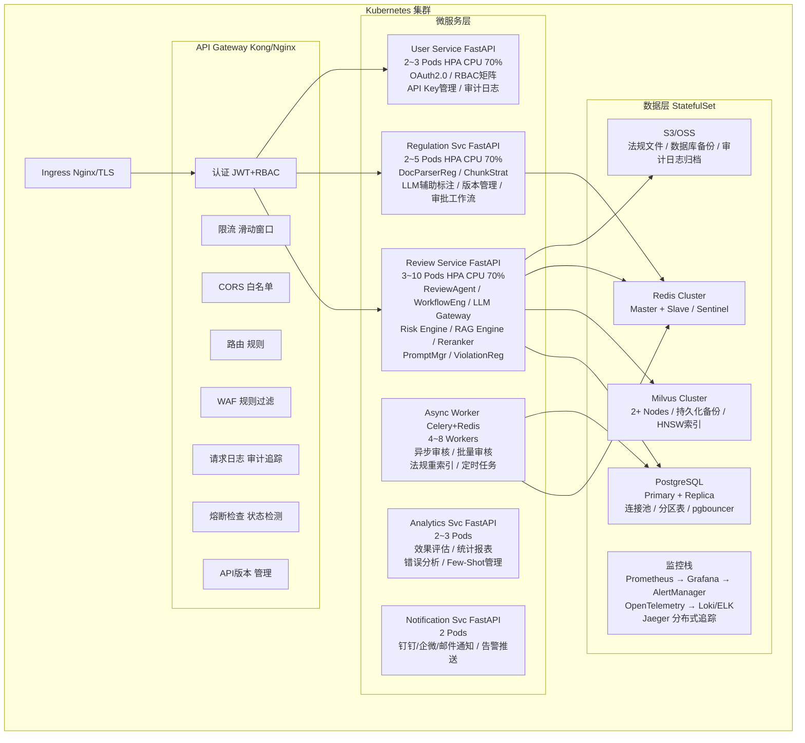
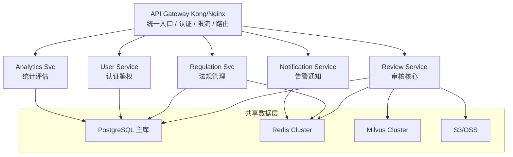
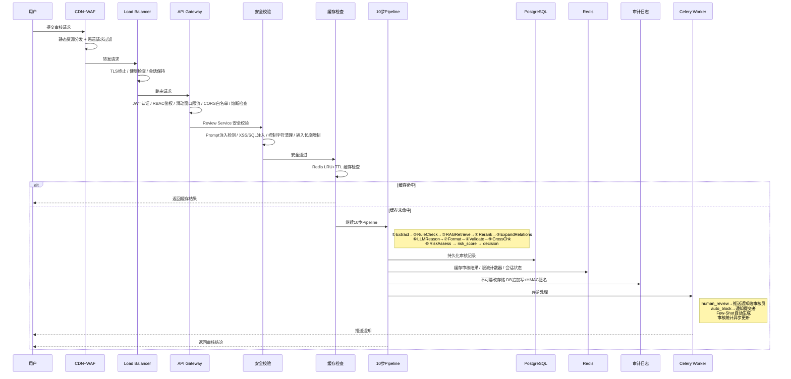
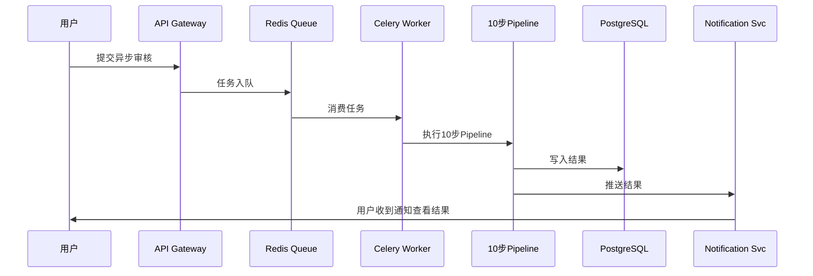
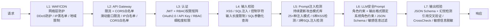
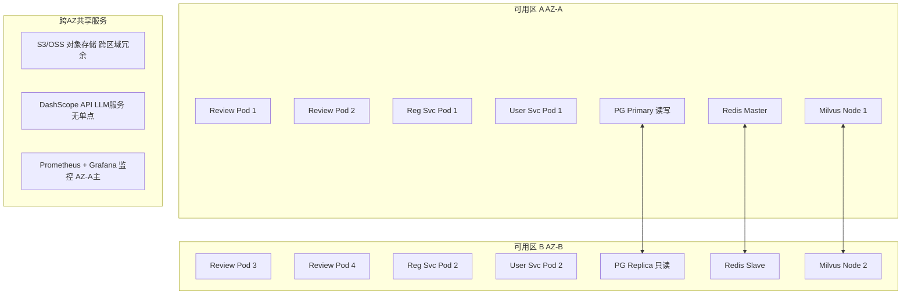
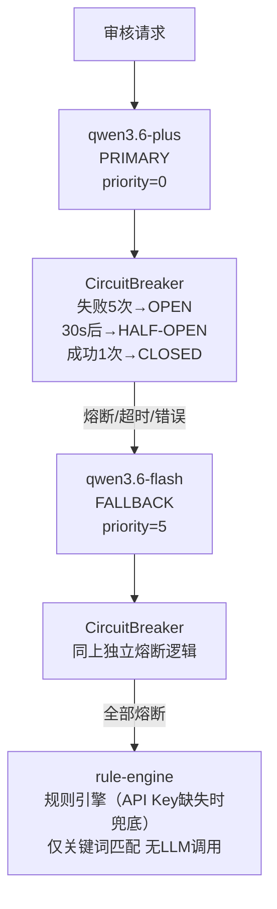
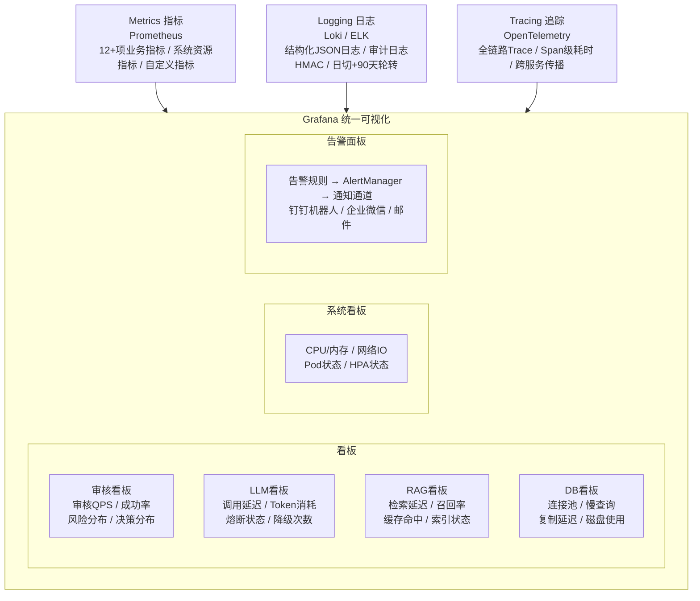
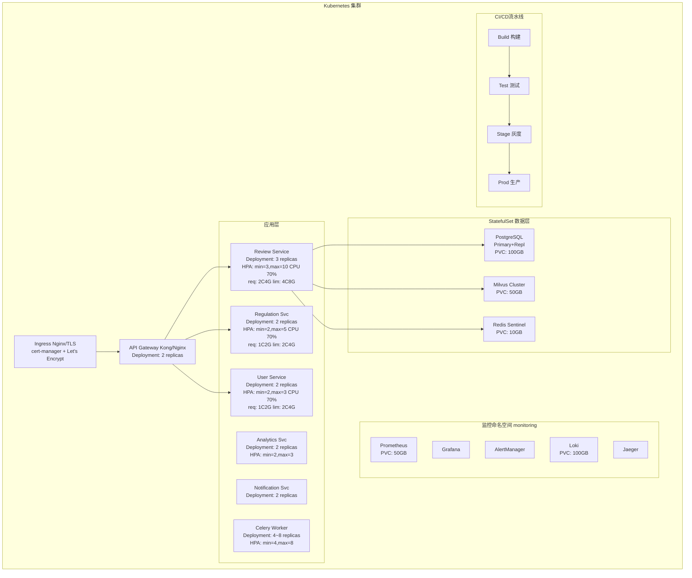

# 保险营销内容智能审核系统 — 生产架构设计

> 版本: v1.0 | 更新日期: 2026-05-16 16:18 | 受众: 架构师、运维工程师、安全工程师、技术负责人

---

## 一、文档说明

本文档描述保险营销内容智能审核系统 **生产版本** 的完整架构设计。生产版本在Demo基础上，针对高可用、高性能、安全合规、可观测性等方面进行了全面升级，满足金融行业生产级部署要求。

### 1.1 生产版本定位

| 维度 | 说明 |
|------|------|
| 目标用户 | 保险公司合规部门、营销团队、监管对接 |
| 并发支持 | 100+ QPS，多用户并发 |
| 数据规模 | 50+部法规文档，万级审核记录 |
| 可用性要求 | SLA 99.9%，RPO 1h，RTO 15min |
| 部署方式 | Kubernetes集群，多AZ部署 |

### 1.2 相关文档

| 文档 | 说明 |
|------|------|
| [architecture-demo.md](architecture-demo.md) | Demo版本架构设计 |
| [architecture-overview.md](architecture-overview.md) | 架构总览（含Demo/生产统一描述） |
| [demo-production-gap.md](demo-production-gap.md) | Demo→生产差异清单 |
| [technology-selection.md](technology-selection.md) | 技术选型决策 |
| [database-design.md](database-design.md) | 数据库设计（含PostgreSQL迁移指南） |
| [deployment-guide.md](deployment-guide.md) | 部署指南（含K8s配置） |

---

## 二、系统上下文图（System Context Diagram）

展示生产系统与外部参与者及外部系统的交互关系。

```mermaid
flowchart TB
    subgraph actors [外部参与者]
        A1[业务人员<br/>提交审核]
        A2[合规审核员<br/>人工复核]
        A3[系统管理员<br/>类型管理]
        A4[运维工程师<br/>系统运维]
    end

    CDN[CDN 静态资源<br/>React SPA分发]
    LB[Load Balancer SLB/ALB<br/>TLS终止 / 健康检查 / 会话保持]

    subgraph system [保险营销内容智能审核系统 生产]
        APIGW[API Gateway<br/>Kong/Nginx]
        REV[Review Service<br/>审核核心]
        REG[Regulation Service<br/>法规管理]
        USR[User Service<br/>认证/RBAC]
        ANA[Analytics Service<br/>统计/评估]
        NOTIF[Notification Service<br/>告警通知]
    end

    subgraph external [外部系统]
        LLM[LLM API 多模型容灾<br/>qwen3.6-plus / qwen3.6-flash(后备)<br/>多Key轮转]
        PG[PostgreSQL<br/>主从复制<br/>连接池 / 分区表]
        REDIS[Redis<br/>缓存/限流<br/>Session / Rate Limit / Cache / Queue]
        OSS[S3/OSS<br/>法规文件 / 数据库备份 / 审计日志归档]
        MILVUS[Milvus<br/>向量集群<br/>分布式 / 持久化备份]
        MON[监控栈<br/>Prometheus → Grafana → AlertManager<br/>OpenTelemetry → Loki/ELK<br/>钉钉/企微/邮件 告警通道]
    end

    A1 --> CDN
    A2 --> CDN
    A3 --> CDN
    A4 --> MON
    CDN --> LB
    LB --> APIGW
    APIGW --> REV
    APIGW --> REG
    APIGW --> USR
    REV --> LLM
    REV --> PG
    REV --> REDIS
    REV --> MILVUS
    REV --> OSS
    REG --> PG
    REG --> REDIS
    USR --> PG
```

### 交互说明

| 参与者/系统 | 交互方式 | 说明 |
|------------|---------|------|
| 业务人员 | CDN → React SPA → API Gateway | 提交营销内容审核，查看审核结论 |
| 合规审核员 | CDN → React SPA → API Gateway | 专业审核工作台，批量操作+快捷键 |
| 系统管理员 | CDN → React SPA → API Gateway | 违规类型管理，效果评估，系统配置 |
| 运维工程师 | Grafana Dashboard | 监控告警，容量规划，故障排查 |
| LLM API (qwen3.6-plus/qwen3.6-flash) | HTTPS REST → DashScope | 多模型容灾，多Key轮转，自动fallback |
| PostgreSQL | TCP/IP | 主从复制，连接池，分区表 |
| Redis | TCP/IP | 分布式缓存，限流，会话管理 |
| Milvus | gRPC | 分布式向量检索，持久化备份 |
| S3/OSS | HTTPS | 法规文件，数据库备份，审计日志归档 |

---

## 三、容器图（Container Diagram）

展示生产系统的容器（服务）组成及通信方式。



### 容器通信说明

| 源 | 目标 | 协议 | 说明 |
|----|------|------|------|
| 浏览器 | CDN | HTTPS | React SPA静态资源分发 |
| React SPA | API Gateway | HTTPS | RESTful API调用 |
| API Gateway | Review Service | HTTP (集群内) | 审核请求路由 |
| API Gateway | Regulation Service | HTTP (集群内) | 法规管理路由 |
| API Gateway | User Service | HTTP (集群内) | 认证鉴权路由 |
| Review Service | PostgreSQL | TCP | 审核数据持久化 |
| Review Service | Milvus | gRPC | 向量检索 |
| Review Service | Redis | TCP | 缓存/限流/队列 |
| Regulation Service | Redis | TCP | 法规元数据缓存/分布式锁/异步任务队列 |
| Review Service | LLM API | HTTPS | DashScope多Key轮转 |
| Async Worker | Redis | TCP | 任务队列消费 |
| Async Worker | PostgreSQL | TCP | 异步审核结果写入 |
| 所有服务 | Prometheus | HTTP | 指标暴露 |
| 所有服务 | OpenTelemetry | gRPC | 分布式追踪 |

---

## 四、微服务拆分

### 4.1 服务拆分方案



### 4.2 各服务职责

| 服务 | 职责 | 核心模块 | 数据归属 | 扩缩容策略 |
|------|------|---------|---------|-----------|
| **Review Service** | 审核核心业务 | ReviewAgent, WorkflowEngine, LLM Gateway, Risk Engine, RAG Engine, Reranker, PromptManager, ViolationRegistry | review_records, review_violations, violation_feedback | HPA: 3~10 Pods, CPU 70% |

**Review Service人工审核增强**：人工审核修改时，可选择AI一键生成修改理由（基于修改前后差异调用LLM生成）
| **Regulation Service** | 法规文档管理 | DocParserReg, ChunkStrat, LLM辅助标注, 版本管理, 审批工作流 | regulation_versions, clause_type_mappings | HPA: 2~5 Pods, CPU 70% |

**Regulation Service Redis用途**：
- 缓存法规文档元数据（文档列表、版本信息、条款映射），减少数据库查询
- 分布式锁：并发上传法规文档时防止重复处理（同一文档只允许一个上传解析流程）
- 异步任务队列：文档解析、向量化等耗时任务通过Redis Queue异步处理
| **User Service** | 认证鉴权 | OAuth2.0, RBAC权限矩阵, API Key管理, 审计日志 | users, audit_events | HPA: 2~3 Pods, CPU 70% |
| **Analytics Service** | 统计评估 | Evaluator, 统计报表, 错误分析, Few-Shot管理, 用户行为分析(审核操作统计/违规趋势分析) | 评估报告, 统计数据, 行为分析数据 | HPA: 2~3 Pods, CPU 70% |
| **Notification Service** | 告警通知 | 钉钉/企微/邮件通知, 告警推送, 审核待办提醒 | notification_records | 固定 2 Pods |

### 4.3 服务间通信

| 通信方式 | 场景 | 说明 |
|---------|------|------|
| HTTP REST | 同步调用 | API Gateway → 各服务，服务间查询 |
| Redis Queue | 异步调用 | Review Service → Async Worker（异步审核/批量审核） |
| 共享数据库 | 数据共享 | 各服务访问PostgreSQL中归属自己的表 |
| 事件通知 | 解耦通信 | Regulation Service → Notification Service（法规变更通知） |

### 4.4 服务拆分原则

1. **业务边界清晰**：每个服务对应独立的业务域，减少跨服务事务
2. **数据归属明确**：每个服务拥有自己的数据表，其他服务通过API访问
3. **独立部署**：每个服务可独立构建、部署、扩缩容
4. **故障隔离**：单个服务故障不影响其他服务（通过熔断器实现）
5. **渐进拆分**：从单体FastAPI逐步拆分，优先拆分Review Service

---

## 五、数据流图

展示生产环境中一次完整审核请求的数据流转过程，包含异步处理和缓存机制。



### 5.1 异步审核流程

对于批量审核和耗时较长的审核请求，系统支持异步处理：



### 5.2 长文本分段审核（生产专属）

当待审核内容超过5000字符时，生产环境启用语义分段审核：

1. `split_by_semantic()` 按段落/主题边界切分，每段不超过3000字符
2. 每段独立走完整10步审核流水线，Top-K独立计算
3. `merge_results()` 合并各段结果：
   - 违规类型取并集
   - 引用条款去重
   - 置信度取加权平均

API Key缺失时不拆分长文本，超过MAX_INPUT_LENGTH(10000)直接截断。

### 5.3 表格处理（生产增强）

| 表格类型 | 处理方式 |
|---------|---------|
| 简单表格 | Markdown格式存储 |
| 复杂表格（合并单元格） | 保留合并单元格结构 |
| 跨页表格 | 自动识别并合并 |
| 超长表格（>50行） | LLM分层摘要+关键行保留，Token超限时分层切分摘要 |

API Key缺失时对复杂表格降级为简单Markdown，超长表格截断至前50行。

---

## 六、安全架构

### 缓存机制设计

系统采用L1/L2两级缓存架构，兼顾响应速度与数据一致性：

| 层级 | 实现 | 容量 | TTL | 用途 |
|------|------|------|-----|------|
| L1 Cache | 进程内LRU缓存（resilience.py review_cache） | 500条 | 30min | 审核结果热点缓存，避免重复计算 |
| L2 Cache | Redis分布式缓存 | 按内存上限自动淘汰 | 1h | 审核结果、法规元数据，跨实例共享 |

**Cache Key设计**：

```
cache_key = hash(input_content + model_config)
```

将输入内容与当前模型配置拼接后取哈希，确保模型切换或配置变更时缓存自动失效。

**缓存失效策略**：

| 触发条件 | 失效范围 | 说明 |
|---------|---------|------|
| 法规文档更新 | 涉及该法规的所有缓存 | 法规变更后旧审核结论可能不再适用 |
| 违规类型变更 | 全部缓存 | 违规类型增删改影响审核判定逻辑 |
| 模型配置变更 | 全部缓存 | 模型切换或参数调整导致输出不同 |

**缓存命中率目标**：>60%（针对重复内容场景，如相同营销文案多次提交审核）

### 向量化内容去重

生产环境中，法规文档可能以不同文件名重复上传（如同一法规的多个版本副本），需要内容级去重避免向量化冗余：

| 维度 | 说明 |
|------|------|
| 当前限制（API Key缺失时） | 按文件名去重，相同内容不同文件名会被向量化两次 |
| 生产方案 | 向量化前计算`content_hash`（SHA256前16位），写入向量库`doc_content_hash`元数据字段 |
| 去重逻辑 | 添加新文档前，先查询向量库中是否已存在相同`doc_content_hash`，若存在则跳过向量化 |
| 实现方式 | Milvus中通过`doc_content_hash`字段建立标量索引，插入前执行`query(expr='doc_content_hash == "xxx"')`检查 |

```python
import hashlib

def compute_content_hash(sections: list) -> str:
    content = "".join(s["article_text"] for s in sections)
    return hashlib.sha256(content.encode("utf-8")).hexdigest()[:16]

def add_documents_with_dedup(chunks, collection):
    content_hash = compute_content_hash(chunks)
    existing = collection.query(expr=f'doc_content_hash == "{content_hash}"')
    if existing:
        return
    collection.insert(data=[{**c.metadata, "doc_content_hash": content_hash} for c in chunks])
```

---

## 七、安全架构

### 6.1 多层纵深防御



### 6.2 RBAC权限矩阵

| 操作 | viewer | reviewer | admin | 说明 |
|------|--------|----------|-------|------|
| 提交审核 | ✅ | ✅ | ✅ | 所有角色可提交 |
| 查看审核结果 | ✅ | ✅ | ✅ | 所有角色可查看 |
| 人工复核/Override | ❌ | ✅ | ✅ | 需reviewer及以上 |
| 提交逐项反馈 | ❌ | ✅ | ✅ | 需reviewer及以上 |
| 管理Few-Shot | ❌ | ✅ | ✅ | 需reviewer及以上 |
| 查看审计日志 | ❌ | ✅(只读) | ✅ | reviewer只读，admin可导出 |
| 创建/废弃违规类型 | ❌ | ❌ | ✅ | 仅admin |
| 管理条款映射 | ❌ | ❌ | ✅ | 仅admin |
| 管理用户 | ❌ | ❌ | ✅ | 仅admin |
| 系统配置 | ❌ | ❌ | ✅ | 仅admin |
| 上传法规文档 | ❌ | ❌ | ✅ | 仅admin |

**冲突解决规则**：一个人可兼任多个角色，权限冲突时**就高不就低**。优先级: admin > reviewer > viewer。所有权限决策记录在审计日志中。

### 6.5 输入长度限制

针对用户可能上传长文本（如几千字的文章），前后端需设置合理的输入长度限制。

| 维度 | Demo | 生产 |
|------|------|------|
| 最大输入长度 | MAX_INPUT_LENGTH = 10000字符（覆盖99%营销内容场景） | 50000字符，超长内容自动分块审核 |
| 前端处理 | 显示字符计数和限制提示 | 显示字符计数和限制提示 |
| 后端处理 | 超长输入返回413错误并提示分块提交 | 超长输入返回413错误并提示分块提交 |

**典型内容长度参考：**

| 场景 | 典型长度 | 说明 |
|------|---------|------|
| 海报文案 | 50-200字符 | 短文案，图片配文 |
| 朋友圈 | 100-500字符 | 社交媒体推广 |
| 短视频脚本 | 500-2000字符 | 视频口播文案 |
| 公众号推文 | 3000-8000字 | 长文章，需完整审核 |
| 产品说明书 | 5000-20000字 | 超长内容，需分块审核 |

### 6.5.1 文件上传（生产专属）

生产环境支持用户上传文件进行审核：
- 支持格式：PDF（文本型/混合型）、DOCX、DOC、图片（JPG/PNG/GIF/BMP）
- 文本型PDF：直接提取文本层
- 混合型PDF：OCR提取扫描部分+多模态模型理解图片
- 图片：多模态模型直接理解内容
- 非PDF文档：自动转换为PDF后按PDF流程处理

API Key缺失时禁止文件上传，仅支持文本输入。

### 6.6 审计日志

| 维度 | 说明 |
|------|------|
| 记录范围 | 全链路操作：认证、审核、override、类型管理、系统配置 |
| 完整性保护 | HMAC-SHA256签名，防篡改 |
| 存储方式 | 数据库追加写表（不可修改），按月分区归档 |
| 保留期限 | 365天在线查询，更早数据归档至OSS |
| 查询能力 | 按用户/时间/事件类型/操作对象多维查询 |

### 6.7 数据加密

| 维度 | 说明 |
|------|------|
| 传输加密 | TLS 1.3，全链路HTTPS |
| 存储加密 | PostgreSQL TDE（透明数据加密） |
| 字段加密 | 密码(PBKDF2-SHA256→bcrypt/argon2)、API Key(SHA-256) |
| 密钥管理 | KMS/Vault，密钥轮转90天 |
| 备份加密 | OSS服务端加密(SSE-S3/SSE-KMS) |

---

## 七、高可用设计

### 7.1 多AZ部署



### 7.2 数据库高可用

| 组件 | 方案 | RPO | RTO |
|------|------|-----|-----|
| PostgreSQL | 主从复制 + 自动故障切换 | < 1min | < 2min |
| Redis | Sentinel哨兵 + 主从切换 | < 10s | < 30s |
| Milvus | 分布式集群 + 副本 | < 5min | < 5min |
| S3/OSS | 跨区域冗余 | 0 | 0 |

### 7.3 LLM模型故障转移



### 7.4 熔断器模式

| 参数 | 值 | 说明 |
|------|-----|------|
| 失败阈值 | 5次 | 连续失败5次触发熔断 |
| 恢复超时 | 30s | 熔断30s后进入半开状态 |
| 半开探测 | 1次 | 半开状态允许1次请求探测 |
| 重试策略 | 指数退避+抖动 | 最多3次重试 |
| 降级策略 | PRIMARY→FALLBACK→rule-engine | 逐级降级 |

### 7.4.1 模型降级链（生产专属）

生产环境启用模型降级链：主模型失败时自动切换到备选模型。
API Key缺失时不启用模型降级，仅使用rule-engine或用户指定的单一模型。

### 7.5 优雅降级

| 故障场景 | 降级策略 | 用户体验 |
|---------|---------|---------|
| LLM全部不可用 | 规则引擎兜底 | 仅关键词匹配，无语义审核 |
| Milvus不可用 | 关键词检索降级 | 召回率下降，审核覆盖面降低 |
| PostgreSQL主库故障 | 从库提升为主库 | 短暂写入不可用(≤2min) |
| Redis不可用 | 本地缓存降级 | 限流精度下降，缓存命中率降低 |
| Reranker API不可用 | 规则重排序降级 | 法规相关性排序精度下降 |
| DashScope Embedding不可用 | 本地BGE-M3模型 | 向量质量略降，无需API调用 |

---

## 八、可观测性

### 8.1 三大支柱



### 8.2 指标类别说明

| 类别 | 说明 | 示例 |
|------|------|------|
| 业务指标 | 与审核业务直接相关的指标，反映系统业务运行状态 | 审核量、违规率、平均延迟、人工复核率、决策分布 |
| 系统资源指标 | 基础设施层面的指标，反映硬件资源使用情况 | CPU使用率、内存使用率、磁盘IO、网络带宽 |
| 自定义指标 | 用户根据特定需求定义的指标，反映特定业务或技术关注点 | 某类违规的检出率、LLM调用成功率、RAG召回率 |

### 8.3 关键监控指标

| 类别 | 指标 | 告警阈值 | 说明 |
|------|------|---------|------|
| 审核 | review_total | — | 审核请求总量(按status分) |
| 审核 | review_duration_seconds | P95 > 3s | 审核耗时分布 |
| 审核 | review_error_rate | > 10% (5min) | 审核错误率 |
| 审核 | review_decision_distribution | — | 决策分布(auto_pass/review/block) |
| LLM | llm_call_duration_seconds | P95 > 5s | LLM调用耗时 |
| LLM | llm_call_error_rate | > 5% (5min) | LLM调用错误率 |
| LLM | circuit_breaker_state | OPEN | 熔断器状态 |
| LLM | llm_token_usage | — | Token消耗统计 |
| RAG | rag_retrieve_duration_seconds | P95 > 1s | 检索耗时 |
| RAG | rag_cache_hit_rate | < 30% | 缓存命中率 |
| DB | db_connection_pool_usage | > 80% | 连接池使用率 |
| DB | db_query_duration_seconds | P95 > 500ms | 慢查询 |
| 系统 | pod_cpu_usage | > 80% (5min) | Pod CPU使用率 |
| 系统 | pod_memory_usage | > 85% (5min) | Pod内存使用率 |

### 8.4 告警规则

| 告警级别 | 条件 | 通知方式 | 响应时间 |
|---------|------|---------|---------|
| P0-Critical | 服务不可用 / 数据库主库故障 / LLM全部熔断 | 钉钉+电话 | 5min |
| P1-Warning | P95延迟>3s / 错误率>10% / 熔断器OPEN | 钉钉+企微 | 15min |
| P2-Info | 缓存命中率低 / 连接池使用率高 / 磁盘>80% | 企微+邮件 | 1h |

---

## 九、性能目标

### 9.1 核心指标

| 指标 | 目标值 | 测量方式 | 说明 |
|------|--------|---------|------|
| P95延迟 | < 3s | Prometheus histogram | 从请求入口到响应返回 |
| P99延迟 | < 5s | Prometheus histogram | 极端情况下的延迟上限 |
| 吞吐量 | 100 reviews/min | Prometheus counter | 稳态并发审核能力 |
| 峰值吞吐 | 200 reviews/min | 压测验证 | 短时突发流量 |
| 可用性 | 99.9% | SLA计算 | 月度不可用时间≤43min |
| RPO | 1h | 备份策略 | 数据丢失窗口 |
| RTO | 15min | 故障演练 | 服务恢复时间 |

### 9.2 各环节延迟预算

| 环节 | 预算延迟 | 说明 |
|------|---------|------|
| API Gateway | 50ms | 认证+限流+路由 |
| 安全校验 | 20ms | 正则匹配+输入验证 |
| ① Extract | 500ms | qwen3.6-plus轻量提取 |
| ② RuleCheck | 10ms | 关键词匹配 |
| ③ RAGRetrieve | 300ms | Milvus向量+BM25混合检索 |
| ④ Rerank | 200ms | Cross-Encoder重排 |
| ⑤ ExpandRelations | 50ms | 相邻条款扩展 |
| ⑥ LLMReason | 1500ms | qwen3.6-plus CoT推理（主要耗时） |
| ⑦ Format | 5ms | 结构化归一化 |
| ⑧ Validate | 10ms | 幻觉检测 |
| ⑨ CrossCheck | 400ms | 同等模型复核 |
| ⑩ RiskAssess | 5ms | 规则评分 |
| **总计** | **~3s** | P95目标 |

### 9.3 容量规划

| 资源 | 规格 | 数量 | 说明 |
|------|------|------|------|
| Review Service Pod | 4C8G | 3~10 | HPA自动扩缩容 |
| Regulation Service Pod | 2C4G | 2~5 | 法规管理低频 |
| User Service Pod | 2C4G | 2~3 | 认证鉴权 |
| Async Worker | 4C8G | 4~8 | Celery Worker |
| PostgreSQL | 4C8G | 主+从 | RDS托管 |
| Redis | 4GB | 主+从+Sentinel | 集群模式 |
| Milvus | 4C8G | 2+ Nodes | 分布式向量 |
| 监控栈 | 4C8G | 1套 | Prometheus+Grafana |

---

## 十、部署架构

### 10.1 Kubernetes部署



### 10.2 部署策略

| 策略 | 说明 | 适用场景 |
|------|------|---------|
| 蓝绿部署 | 两套环境切换，零停机 | 大版本升级 |
| 灰度发布 | 按比例流量切换(5%→25%→100%) | 功能迭代 |
| 滚动更新 | 逐个Pod替换，默认策略 | 日常发布 |
| 金丝雀发布 | 先发布1个Pod观察 | 高风险变更 |

### 10.3 HPA自动扩缩容

```yaml
apiVersion: autoscaling/v2
kind: HorizontalPodAutoscaler
metadata:
  name: review-service
spec:
  scaleTargetRef:
    apiVersion: apps/v1
    kind: Deployment
    name: review-service
  minReplicas: 3
  maxReplicas: 10
  metrics:
    - type: Resource
      resource:
        name: cpu
        target:
          type: Utilization
          averageUtilization: 70
    - type: Pods
      pods:
        metric:
          name: review_requests_per_second
        target:
          type: AverageValue
          averageValue: "20"
  behavior:
    scaleUp:
      stabilizationWindowSeconds: 60
      policies:
        - type: Pods
          value: 2
          periodSeconds: 60
    scaleDown:
      stabilizationWindowSeconds: 300
      policies:
        - type: Pods
          value: 1
          periodSeconds: 120
```

### 10.4 资源配额

| 命名空间 | CPU请求 | CPU上限 | 内存请求 | 内存上限 | Pod数 |
|---------|---------|---------|---------|---------|-------|
| production | 32核 | 64核 | 64GB | 128GB | 100 |
| monitoring | 8核 | 16核 | 16GB | 32GB | 20 |

---

## 十一、技术栈总览

| 层次 | 技术 | 版本/规格 | 说明 |
|------|------|----------|------|
| 前端 | React SPA | 18+ | CDN分发，专业审核工作台 |
| API网关 | Kong/Nginx | — | 认证+限流+路由+熔断 |
| 微服务框架 | FastAPI | 0.100+ | 异步REST框架 |
| LLM | qwen3.6-plus + qwen3.6-flash(后备) | DashScope API | 多模型路由+熔断+降级 |
| Embedding | text-embedding-v3 | DashScope API | 1024维中文向量 |
| Reranker | qwen3-rerank | 独立微服务 | Cross-Encoder重排 |
| 数据库 | PostgreSQL | 15+ | 主从复制+分区表+连接池 |
| 缓存 | Redis | 7+ | Sentinel哨兵+主从 |
| 向量库 | Milvus | 2.x | 分布式集群+持久化 |
| 对象存储 | S3/OSS | — | 法规文件+备份+归档 |
| 异步队列 | Celery + Redis | — | 异步审核+批量处理 |
| 监控 | Prometheus + Grafana | — | 12+项业务指标+系统指标 |
| 日志 | Loki/ELK | — | 结构化日志+审计日志 |
| 追踪 | OpenTelemetry + Jaeger | — | 全链路分布式追踪 |
| 告警 | AlertManager | — | 钉钉/企微/邮件通知 |
| 容器编排 | Kubernetes | 1.27+ | HPA+蓝绿+灰度 |
| CI/CD | GitLab CI / GitHub Actions | — | 自动测试+构建+部署 |
| 密钥管理 | KMS/Vault | — | 密钥轮转+加密存储 |

---

## 十二、Demo→生产迁移路线图

| 阶段 | 时间 | 内容 | 优先级 |
|------|------|------|--------|
| P0 | 上线前 | PostgreSQL迁移 + Milvus部署 + 多Key轮转 + 安全加固 + 监控部署 + K8s容器化 | 必须 |
| P1 | 上线后1月 | Reranker升级 + RBAC增强 + HITL专业工作台 + CrossCheck增强 + 法规管理增强 | 重要 |
| P2 | 迭代优化 | 多模态审核 + Few-Shot自动管理 + 法规知识图谱 + 图文一致性校验 | 改进 |

详细迁移方案请参考 [demo-production-gap.md](demo-production-gap.md)。

---

## 十三、架构师评审反馈与生产优化方向

> 本节整合三位架构师（GPT/DeepSeek/Gemini）对v3.7版本的评审意见，提取对生产架构有价值的改进方向。评审综合评分：8.8~9.5/10，系统已具备生产部署条件。

### 13.1 语义规则引擎 + SLM分层（GPT建议，优先级最高）

**当前短板**：Rule Engine仍基于关键词匹配，无法识别"软违规"（如"财富自由不是梦""收益远超银行"等无明确违规词但存在诱导的表述）。

**生产方案**：三层审核架构

| 层级 | 技术 | 职责 | 延迟目标 |
|------|------|------|---------|
| 第一层：Rule Engine | 关键词+正则 | 明确违规词快速拦截 | <10ms |
| 第二层：SLM Risk Classifier | FinBERT/DeBERTa/Qwen2.5-3B微调 | 语义风险意图分类（收益承诺/诱导营销/风险淡化/身份冒充） | <200ms |
| 第三层：LLM深度推理 | qwen3.6-plus | CoT推理+隐含语义分析 | 1.5~3s |

**实现要点**：
- SLM使用金融合规领域数据微调，4分类（收益承诺/诱导营销/风险淡化/合规）
- SLM输出`risk_intent`和`confidence`，作为`rule_hint`注入LLM Prompt
- 成本优化：SLM推理成本仅为LLM的1/50~1/100

### 13.2 DAG并行流水线（Gemini建议，延迟优化）

**当前问题**：10步串行流水线导致P95延迟可能突破6~8s，无法达成<3s的SLA目标。

**生产方案**：将串行流水线改为DAG（有向无环图）并行执行

```
       ┌─────────────┐
       │ ① Extract   │
       └──────┬──────┘
              │
    ┌─────────┼─────────┐
    ▼         ▼         ▼
┌────────┐┌────────┐┌────────┐
│②RuleChk││③RAGRet ││多模态  │
└────┬───┘└────┬───┘└────┬───┘
     │         │         │
     └─────────┼─────────┘
               ▼
          ┌─────────┐
          │④ Rerank │
          └────┬────┘
               ▼
          ┌──────────┐
          │⑤ExpandRel│
          └────┬─────┘
               ▼
          ┌──────────┐
          │⑥LLMReason│
          └────┬─────┘
               ▼
          ┌──────────┐
          │⑦Format   │
          └────┬─────┘
               ▼
          ┌──────────┐
          │⑧Validate │
          └────┬─────┘
               ▼
          ┌──────────┐
          │⑨CrossChk │
          └────┬─────┘
               ▼
          ┌──────────┐
          │⑩RiskAssess│
          └──────────┘
```

**关键并行点**：
- ②RuleCheck、③RAGRetrieve、多模态处理三者无依赖，可并行执行
- 要素提取可使用轻量级NLP库（HanLP/Spacy）替代LLM，耗时从500ms降至50ms
- 使用`asyncio.gather()`实现并行，预计P95从6~8s降至3~4s

### 13.3 CrossCheck悖论修复（Gemini建议，审核质量优化）

**当前问题**：主模型与复核模型均为qwen3.6-plus，生产环境可配置同级模型复核——使用同能力等级的不同模型进行交叉验证，避免单一模型自圆其说。

**生产方案**：分层CrossCheck策略

| 策略 | 触发条件 | 实现方式 |
|------|---------|---------|
| 规则校验（默认） | 所有审核结果 | 正则+逻辑规则检查：引用条款是否在召回列表中、推理是否包含矛盾词汇、输出格式是否合规 |
| Self-Consistency | risk_score处于边缘阈值（0.6~0.75） | 同一模型多次采样，检查结论一致性 |
| 同级模型复核 | risk_score接近拦截线（0.68~0.72） | qwen3.6-flash作为后备模型进行二次判决 |

**实现要点**：
- 默认使用规则校验，成本为零
- 仅在边缘风险分数时触发LLM复核，避免不必要的API调用
- 同级模型复核仅在API Key可用时启用（API Key缺失时使用规则校验）

### 13.4 上下文压缩（Gemini建议，LLM质量优化）

**当前问题**：ExpandRelations步骤召回大量关联法规后，Prompt长度可能膨胀至5000+ tokens，导致"中间迷失"（Lost in the Middle）——模型忽略藏在中间的豁免条款。

**生产方案**：结构化Prompt优化

| 条款类型 | Prompt呈现方式 | 说明 |
|---------|--------------|------|
| 主判定条款（Top5） | 全文呈现 | 核心判定依据，必须完整 |
| 明确引用类型关联 | 高度浓缩摘要 | 仅提供条款核心主旨（1~2句话） |
| 补充具体化类型关联 | 高度浓缩摘要 | 仅提供补充要点 |
| 例外条款类型关联 | 全文呈现+置末 | 豁免条件必须完整，且置于Prompt末尾（大模型对末尾信息敏感度最高） |

**实现要点**：
- Prompt总长度控制在3000 tokens以内
- exception条款强制置于Prompt最末尾
- 关联条款摘要可在向量化时预生成，存储在chunk元数据中

### 13.5 AI评估平台（GPT建议，质量保障）

**当前状态**：有效果评估模块，但偏静态。

**生产方案**：建设在线评估平台

| 能力 | 说明 | 优先级 |
|------|------|--------|
| Golden Dataset | 黄金测试集（50+标注样本，合规+违规各半） | P0 |
| Prompt Benchmark | Prompt版本对比（recall/hallucination/latency/token cost） | P1 |
| Regression Test | 每次Prompt变更后自动回归测试 | P1 |
| Model Benchmark | 模型切换前A/B对比 | P1 |
| Drift Detection | 按周/月监控Recall/Precision漂移 | P2 |
| FN专项集 | 漏检专项测试集 | P2 |
| Replay System | 历史审核重放验证 | P2 |
| Shadow Evaluation | 影子评估（新模型并行运行但不影响线上决策） | P2 |

### 13.6 模型效果漂移监控（GPT建议，AI Governance）

**当前状态**：有Prompt版本管理和Few-shot治理，但缺少Drift监控。

**生产方案**：

| 监控维度 | 指标 | 告警阈值 | 说明 |
|---------|------|---------|------|
| Recall漂移 | 周对比Recall变化 | 下降>5% | 可能原因：新营销话术/Prompt污染/模型升级/法规变化 |
| Precision漂移 | 周对比Precision变化 | 下降>10% | 误杀率上升 |
| Override Rate | 人工翻转率 | >15% | AI判定与人工判定不一致 |
| Reviewer Agreement | 审核员一致性 | <70% | 审核员之间判定不一致 |
| Prompt Regression | Prompt变更后指标对比 | 任何指标下降 | Prompt变更引入退化 |
| Decision Distribution | 决策分布变化 | 分布偏移>10% | auto_pass/review/block比例异常变化 |

### 13.7 成本治理与多级模型路由（GPT建议，成本优化）

**当前问题**：所有审核都使用qwen3.6-plus，Token成本高。

**生产方案**：多级模型路由

| 场景 | 模型 | 成本 | 说明 |
|------|------|------|------|
| Rule命中（明确违规） | 小模型确认 | 极低 | 关键词命中后仅需小模型确认违规类型 |
| 简单文本（<500字） | qwen3.6-flash | 低 | 短文本快速审核 |
| 边界案例/复杂文本 | qwen3.6-plus | 中 | CoT深度推理 |
| 高风险复核 | qwen-max/qwen3.6-flash | 高 | 仅在边缘风险分数时触发 |

**预估成本优化**：相比全量qwen3.6-plus，成本可降低40~60%。

### 13.8 事件驱动架构（GPT建议，系统解耦）

**当前状态**：服务间偏直接依赖。

**生产方案**：引入事件总线（Kafka/Pulsar）

```
ReviewCompletedEvent → Notification Service（通知）
                    → Analytics Service（统计）
                    → Audit Service（审计）
                    → Feedback Service（反馈收集）
```

**好处**：完全解耦，新增订阅方无需修改发布方代码。

### 13.9 Policy DSL（GPT建议，规则配置化）

**当前状态**：规则和风险决策偏代码化，修改需开发介入。

**生产方案**：DSL化规则配置

```yaml
policy:
  violation: exaggerated_return
  severity: high
  auto_block: true
  risk_threshold: 0.8
  notify: ["compliance_team"]
```

**好处**：合规团队可自行配置规则和风险阈值，无需开发介入。

### 13.10 多租户支持（GPT建议，SaaS化）

**当前状态**：单租户架构。

**生产方案**：

| 能力 | 说明 |
|------|------|
| Tenant Isolation | 数据隔离（行级安全/Schema隔离） |
| Tenant Prompt | 各租户自定义Prompt模板 |
| Tenant Rule | 各租户自定义违规规则和关键词 |
| Tenant Vector Space | 各租户独立向量空间 |
| Tenant Audit | 各租户独立审计日志 |
