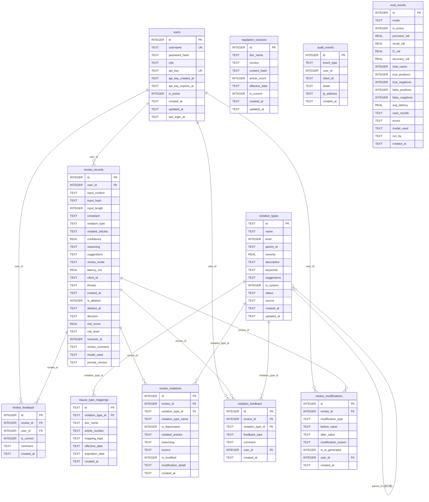

# 保险合规审查系统 — 数据库设计文档

**文档版本**: v3.4
**最后更新**: 2026-05-19（⚠️ Schema 变更时必须同步更新此日期）
**对应代码**: `src/database.py` (`_schema_version = 8`)

---

## 1. 概述

### 1.1 数据库选型

| 项目 | 说明 |
|------|------|
| 数据库引擎 | SQLite 3 |
| 日志模式 | WAL (Write-Ahead Logging) |
| 同步级别 | NORMAL |
| 外键约束 | 启用 (`PRAGMA foreign_keys=ON`) |
| 忙等待超时 | 5000ms |
| 连接超时 | 30s |
| 连接模型 | 线程本地连接 (`threading.local`) |

### 1.2 设计原则

- **迁移驱动**: 通过 `PRAGMA user_version` 跟踪版本，启动时自动执行增量迁移
- **软删除优先**: 核心业务表（`review_records`）采用 `is_deleted` + `deleted_at` 软删除
- **审计追溯**: 所有关键操作写入 `audit_events` 表
- **单例模式**: `Database` 类使用双重检查锁实现线程安全单例

### 1.3 关键配置

| 配置项 | 环境变量 | 默认值 | 说明 |
|--------|---------|--------|------|
| 数据库路径 | `DB_PATH` | `./data/insurance_review.db` | SQLite 文件路径 |
| 备份目录 | `DB_BACKUP_DIR` | `./data/db_backups` | 自动备份存放目录 |
| 最大备份数 | `MAX_BACKUPS` | `7` | 保留最近 N 份备份 |
| 数据保留天数 | `DATA_RETENTION_DAYS` | `365` | 超期数据软删除阈值 |
| API Key 有效期 | `API_KEY_EXPIRE_DAYS` | `90` | API Key 过期天数 |
| 密码盐值 | `PASSWORD_SALT` | `insurance_review_2024_salt` | PBKDF2 加盐 |

---

## 2. ER 关系图



---

## 3. 表结构详细定义

### 3.1 users — 用户表

存储系统用户信息，支持角色权限与 API Key 认证。

| 列名 | 类型 | 约束 | 默认值 | 说明 |
|------|------|------|--------|------|
| `id` | INTEGER | PK, AUTOINCREMENT | — | 用户唯一标识 |
| `username` | TEXT | UNIQUE, NOT NULL | — | 用户名，全局唯一 |
| `password_hash` | TEXT | NOT NULL | — | PBKDF2-SHA256 哈希值（100000 次迭代） |
| `role` | TEXT | NOT NULL | `'reviewer'` | 角色：`viewer` / `reviewer` / `admin` |
| `api_key` | TEXT | UNIQUE | NULL | API 认证密钥，SHA-256 生成前 32 位 |
| `api_key_created_at` | TEXT | — | NULL | API Key 创建时间（v2 迁移新增） |
| `api_key_expires_at` | TEXT | — | NULL | API Key 过期时间（v2 迁移新增），默认创建后 90 天 |
| `is_active` | INTEGER | NOT NULL | `1` | 账户状态：1=启用, 0=禁用 |
| `created_at` | TEXT | NOT NULL | `datetime('now')` | 创建时间 |
| `updated_at` | TEXT | NOT NULL | `datetime('now')` | 更新时间 |
| `last_login_at` | TEXT | — | NULL | 最后登录时间（v3 迁移新增） |

**角色层级**:

```
viewer (0) < reviewer (1) < admin (2)
```

**初始数据**: 系统初始化时自动创建 `admin` 用户（密码 `admin123`），并生成有效期 90 天的 API Key。

---

### 3.2 review_records — 审查记录表

存储保险营销内容合规审查的完整结果，是系统核心业务表。

| 列名 | 类型 | 约束 | 默认值 | 说明 |
|------|------|------|--------|------|
| `id` | INTEGER | PK, AUTOINCREMENT | — | 记录唯一标识 |
| `user_id` | INTEGER | FK → users(id) | NULL | 提交审查的用户 ID |
| `input_content` | TEXT | NOT NULL | — | 待审查的原始输入内容 |
| `input_hash` | TEXT | NOT NULL | — | 输入内容的 SHA-256 哈希，用于去重校验 |
| `input_length` | INTEGER | NOT NULL | — | 输入内容字符长度 |
| `compliant` | TEXT | NOT NULL | — | 合规判定：`'yes'` / `'no'` |
| `violation_type` | TEXT | NOT NULL | `''` | ~~已废弃~~ 违规类型名称（"、"分隔字符串），违规类型信息现已迁移至 `violated_articles` JSON 数组及 `review_violations` 关系表，保留此列仅为旧版本查询兼容 |
| `violated_articles` | TEXT | NOT NULL | `'[]'` | 违规详情 JSON 数组，按违规类型分组。格式: `[{"violation_type_id": "return_promise", "violation_type_name": "收益承诺", "articles": [{"doc_name": "...", "article_number": "...", "violation_reason": "..."}], "reasoning": "..."}]`。注意：`article_text` 字段不由LLM直接输出，而是由Validate步骤从RAG法规库中根据`doc_name`+`article_number`自动回填 |
| `confidence` | REAL | NOT NULL | `0.0` | 判定置信度 [0.0, 1.0] |
| `reasoning` | TEXT | NOT NULL | `''` | 判定推理过程 |
| `suggestions` | TEXT | NOT NULL | `''` | 合规修改建议（LLM 输出字段，非输入） |
| `review_mode` | TEXT | NOT NULL | `'llm'` | 审查模式：`'llm'` / `'rule'` / `'rule+llm'` |
| `latency_ms` | REAL | NOT NULL | `0.0` | 审查耗时（毫秒） |
| `client_id` | TEXT | NOT NULL | `'anonymous'` | 调用方客户端标识 |
| `threats` | TEXT | NOT NULL | `'[]'` | 输入验证安全威胁标签 JSON 数组（如 prompt_injection、xss_attempt） |
| `created_at` | TEXT | NOT NULL | `datetime('now')` | 创建时间 |
| `is_deleted` | INTEGER | NOT NULL | `0` | 软删除标记：0=正常, 1=已删除 |
| `deleted_at` | TEXT | — | NULL | 软删除时间 |
| `decision` | TEXT | NOT NULL | `'auto_pass'` | 决策结果：`auto_pass` / `human_review` / `auto_block`（v4 迁移新增） |
| `risk_score` | REAL | NOT NULL | `0.0` | 风险评分 [0.0, 1.0]（v4 迁移新增） |
| `risk_level` | TEXT | NOT NULL | `'low'` | 风险等级：`low` / `medium` / `high`（v4 迁移新增） |
| `reviewer_id` | INTEGER | — | NULL | 人工复审人用户 ID（v4 迁移新增） |
| `review_comment` | TEXT | — | NULL | 人工复审意见（v4 迁移新增） |
| `model_used` | TEXT | NOT NULL | `''` | 使用的 LLM 模型标识（v4 迁移新增） |
| `prompt_version` | TEXT | NOT NULL | `''` | 使用的 Prompt 版本标识（v4 迁移新增） |

**决策逻辑**:

```
risk_score ≤ 0.1  → auto_pass（自动通过）
0.1 < risk_score ≤ 0.7 → human_review（人工复审）
risk_score > 0.7 → auto_block（自动拦截）
```

**violation_type 列废弃说明**:

`violation_type` 列已废弃。违规类型信息现在存储在 `violated_articles` 的 JSON 数组中（每个类型有自己的 articles 和 reasoning），以及 `review_violations` 关系表中。保留此列仅为旧版本查询兼容。

**suggestions 字段说明**:

`suggestions` 是 LLM 的输出字段，不是输入字段。LLM 不会读取此字段的内容，而是根据审查结果生成建议并写入此字段。当 LLM 降级为规则引擎模式（`review_mode='rule'`）时，suggestions 由各违规类型的预定义模板生成（即 `violation_types.suggestions` 中的内容）。

**JSON 字段格式**:

```json
// violated_articles — 按违规类型分组的违规详情
[
  {
    "violation_type_id": "return_promise",
    "violation_type_name": "收益承诺",
    "articles": [
      {
        "doc_name": "保险销售行为管理办法",
        "article_number": "第十二条",
        "article_text": "保险公司、保险中介机构及其保险销售人员不得承诺不确定的收益...",
        "violation_reason": "文案中'稳赚不赔'构成收益承诺"
      }
    ],
    "reasoning": "文案使用'稳赚不赔'表述，违反收益承诺相关规定"
  },
  {
    "violation_type_id": "absolute_language",
    "violation_type_name": "绝对化用语",
    "articles": [
      {
        "doc_name": "广告法",
        "article_number": "第九条",
        "article_text": "广告不得使用'国家级'、'最高级'、'最佳'等用语...",
        "violation_reason": "'绝对安全'属于绝对化用语"
      }
    ],
    "reasoning": "文案使用'绝对安全'绝对化表述"
  }
]

// threats — 输入验证安全威胁标签（非违规类型）
["prompt_injection", "xss_attempt"]
```

---

### 3.3 review_feedback — 审查反馈表

存储用户对审查结果的反馈，用于模型准确率评估与持续优化。

| 列名 | 类型 | 约束 | 默认值 | 说明 |
|------|------|------|--------|------|
| `id` | INTEGER | PK, AUTOINCREMENT | — | 反馈唯一标识 |
| `review_id` | INTEGER | FK → review_records(id), NOT NULL | — | 关联的审查记录 ID |
| `user_id` | INTEGER | FK → users(id) | NULL | 提交反馈的用户 ID |
| `is_correct` | INTEGER | NOT NULL | — | 审查结果是否正确：1=正确, 0=错误 |
| `comment` | TEXT | NOT NULL | `''` | 反馈补充说明 |
| `created_at` | TEXT | NOT NULL | `datetime('now')` | 反馈创建时间 |

---

### 3.4 regulation_versions — 法规版本表

存储法规文档的版本管理信息，支持法规更新与历史追溯。

| 列名 | 类型 | 约束 | 默认值 | 说明 |
|------|------|------|--------|------|
| `id` | INTEGER | PK, AUTOINCREMENT | — | 版本唯一标识 |
| `doc_name` | TEXT | NOT NULL | — | 法规文档名称（如"保险销售行为管理办法"） |
| `version` | TEXT | NOT NULL | — | 版本号 |
| `content_hash` | TEXT | NOT NULL | — | 文档内容的 SHA-256 哈希 |
| `article_count` | INTEGER | NOT NULL | `0` | 文档包含的条款数量 |
| `effective_date` | TEXT | — | NULL | 法规生效日期 |
| `is_current` | INTEGER | NOT NULL | `1` | 是否为当前版本：1=是, 0=否 |
| `created_at` | TEXT | NOT NULL | `datetime('now')` | 创建时间 |
| `updated_at` | TEXT | NOT NULL | `datetime('now')` | 更新时间 |

**版本切换逻辑**: 上传新版本时，自动将同一 `doc_name` 的旧版本 `is_current` 置为 `0`，新版本置为 `1`。

**`is_current` 新版本说明**: "新版本"是指同一 `doc_name` 文档的再次上传。当系统检测到相同文档名称但不同内容（不同 `content_hash`）的上传时，将旧版本的 `is_current` 设为 `0`，新版本的 `is_current` 设为 `1`。系统通过匹配 `doc_name` 来识别同一文档的新版本。

**`effective_date` 说明**: Demo版本不支持手动设置法规生效日期，`effective_date` 自动设为上传时间。生产版本应支持从法规原文中提取生效日期（如"自2026年7月1日起施行"），或由管理员手动设置。

---

### 3.5 audit_events — 审计事件表

记录系统关键操作的审计日志，用于安全追溯与合规审计。

| 列名 | 类型 | 约束 | 默认值 | 说明 |
|------|------|------|--------|------|
| `id` | INTEGER | PK, AUTOINCREMENT | — | 事件唯一标识 |
| `event_type` | TEXT | NOT NULL | — | 事件类型（见下表） |
| `user_id` | INTEGER | — | NULL | 操作用户 ID |
| `client_id` | TEXT | NOT NULL | `'anonymous'` | 客户端标识 |
| `detail` | TEXT | NOT NULL | `''` | 事件详情描述 |
| `ip_address` | TEXT | NOT NULL | `''` | 请求来源 IP 地址 |
| `created_at` | TEXT | NOT NULL | `datetime('now')` | 事件创建时间 |

**常见 event_type**:

| event_type | 说明 |
|------------|------|
| `feedback` | 提交审查反馈 |
| `hard_delete_review` | 硬删除审查记录 |
| `regulation_update` | 法规版本更新 |

---

### 3.6 violation_types — 违规类型表

存储违规类型的层级分类体系，支持两级树形结构（L1 大类 → L2 子类）。

| 列名 | 类型 | 约束 | 默认值 | 说明 |
|------|------|------|--------|------|
| `id` | TEXT | PK | — | 违规类型唯一标识（如 `absolute_language`） |
| `name` | TEXT | NOT NULL | — | 违规类型中文名称 |
| `level` | INTEGER | NOT NULL | `2` | 层级：1=一级大类, 2=二级子类 |
| `parent_id` | TEXT | — | NULL | 父类型 ID（自引用，L2 类型指向 L1 类型） |
| `severity` | REAL | NOT NULL | `0.5` | 严重程度 [0.0, 1.0] |
| `description` | TEXT | NOT NULL | `''` | 违规类型描述 |
| `keywords` | TEXT | NOT NULL | `'[]'` | 关键词列表 JSON 数组，用于规则匹配 |
| `suggestions` | TEXT | NOT NULL | `''` | 合规修改建议 |
| `is_system` | INTEGER | NOT NULL | `0` | 是否系统预定义：1=是, 0=用户自定义 |
| `status` | TEXT | NOT NULL | `'active'` | 状态：`active` / `deprecated` |
| `source` | TEXT | NOT NULL | `'regulation'` | 来源：`regulation`（监管法规）/ `industry`（行业自律）/ `internal`（公司内部）（v6 迁移新增） |
| `created_at` | TEXT | NOT NULL | `datetime('now')` | 创建时间 |
| `updated_at` | TEXT | NOT NULL | `datetime('now')` | 更新时间 |

**预定义 L1 大类**:

| id | name | severity | source |
|----|------|----------|--------|
| `false_publicity` | 虚假宣传 | 1.0 | regulation |
| `qualification_violation` | 资质违规 | 1.0 | regulation |
| `sales_misconduct` | 销售行为违规 | 1.0 | regulation |
| `info_disclosure` | 信息披露违规 | 1.0 | regulation |
| `info_protection` | 信息保护违规 | 1.0 | regulation |

**预定义 L2 子类**:

| id | name | parent_id | severity | source | keywords 示例 |
|----|------|-----------|----------|--------|---------------|
| `absolute_language` | 绝对化用语 | `false_publicity` | 1.0 | regulation | 稳赚不赔, 保本保息, 无风险 |
| `return_promise` | 收益承诺 | `false_publicity` | 1.0 | regulation | 保证收益, 承诺收益 |
| `exaggerated_return` | 夸大收益 | `false_publicity` | 1.0 | regulation | 年化收益, 收益率高达 |
| `product_confusion` | 产品混淆 | `false_publicity` | 1.0 | regulation | 存款, 理财, 基金 |
| `unauthorized_endorsement` | 无资质代言 | `qualification_violation` | 1.0 | regulation | 明星, 网红, 代言 |
| `inducement_sales` | 诱导销售 | `sales_misconduct` | 1.0 | regulation | 赠送, 返现, 红包 |
| `concealment` | 隐瞒信息 | `info_disclosure` | 1.0 | regulation | — |
| `insufficient_risk_disclosure` | 风险提示不足 | `info_disclosure` | 1.0 | regulation | — |
| `privacy_violation` | 信息保护 | `info_protection` | 1.0 | regulation | — |
| `other_violation` | 其他违规 | `false_publicity` | 1.0 | regulation | — |

**废弃逻辑**: 当类型被废弃时，其 `status` 置为 `deprecated`，同时关联的所有未过期 `clause_type_mappings` 自动设置 `expiration_date`。

---

### 3.7 clause_type_mappings — 条款类型映射表

存储法规条款与违规类型的映射关系，建立"法规条文 ↔ 违规类型"的桥梁。

| 列名 | 类型 | 约束 | 默认值 | 说明 |
|------|------|------|--------|------|
| `id` | TEXT | PK | — | 映射唯一标识（UUID 前 8 位） |
| `violation_type_id` | TEXT | FK → violation_types(id), NOT NULL | — | 关联的违规类型 ID |
| `doc_name` | TEXT | NOT NULL | — | 法规文档名称 |
| `article_number` | TEXT | NOT NULL | — | 条款编号（如"二十一"） |
| `mapping_logic` | TEXT | NOT NULL | `'primary'` | 映射逻辑：`primary`（主要）/ `secondary`（次要） |
| `effective_date` | TEXT | NOT NULL | `datetime('now')` | 映射生效时间 |
| `expiration_date` | TEXT | — | NULL | 映射过期时间，NULL 表示永久有效 |
| `created_at` | TEXT | NOT NULL | `datetime('now')` | 创建时间 |

**映射逻辑说明**:

- `primary`: 该条款是此违规类型的主要法规依据
- `secondary`: 该条款是此违规类型的补充法规依据

**去重机制**: 添加映射时，若同一 `violation_type_id + doc_name + article_number` 且 `expiration_date IS NULL` 的记录已存在，则跳过不重复创建。

---

### 3.8 review_violations — 审查违规关联表

存储审查记录与违规类型的关联关系，替代 `review_records.violation_type` 的多值字符串方式，实现规范化的多对多存储。

| 列名 | 类型 | 约束 | 默认值 | 说明 |
|------|------|------|--------|------|
| `id` | INTEGER | PK, AUTOINCREMENT | — | 关联唯一标识 |
| `review_id` | INTEGER | FK → review_records(id), NOT NULL | — | 关联的审查记录 ID |
| `violation_type_id` | TEXT | FK → violation_types(id), NOT NULL | — | 关联的违规类型 ID |
| `violation_type_name` | TEXT | NOT NULL | — | 违规类型名称（写入时快照，防止类型重命名后丢失历史信息） |
| `is_deprecated` | INTEGER | NOT NULL | `0` | 关联时违规类型是否已废弃：0=否, 1=是 |
| `violated_articles` | TEXT | NOT NULL | `'[]'` | 该类型引用的条款 JSON 数组 |
| `reasoning` | TEXT | NOT NULL | `''` | 该类型的推理原因 |
| `source` | TEXT | NOT NULL | `'system'` | 来源：`system`（系统生成）或 `human_added`（人工添加） |
| `is_modified` | INTEGER | NOT NULL | `0` | 是否被人工修改过：0=否, 1=是 |
| `modification_detail` | TEXT | NOT NULL | `''` | 修改详情 JSON |
| `created_at` | TEXT | NOT NULL | `datetime('now')` | 关联创建时间 |

**设计说明**:

- 替代 `review_records.violation_type` 列的"、"分隔字符串方式，实现规范化存储
- `violation_type_name` 为写入时快照，即使 `violation_types` 表中类型被重命名或废弃，历史记录仍可追溯
- `is_deprecated` 标记关联时违规类型的废弃状态，便于筛选已废弃类型的审查记录
- 一条审查记录可关联多个违规类型，每条关联为独立行

**review_violations 与 violation_feedback 的关系**:

- `review_violations`: 记录审查记录关联了哪些违规类型（系统结果+人工修改后的最终结果）
- `violation_feedback`: 记录用户对某个具体违规类型的反馈（correct/missed/false_positive/wrong_citation），用于模型评估
- 两者关系：review_violations 是"结果"，violation_feedback 是"评价"

---

### 3.9 violation_feedback — 违规类型反馈表

存储用户对审查记录中具体违规类型的反馈，支持细粒度的违规判定质量评估与校准。

| 列名 | 类型 | 约束 | 默认值 | 说明 |
|------|------|------|--------|------|
| `id` | INTEGER | PK, AUTOINCREMENT | — | 反馈唯一标识 |
| `review_id` | INTEGER | FK → review_records(id), NOT NULL | — | 关联的审查记录 ID |
| `violation_type_id` | TEXT | FK → violation_types(id), NOT NULL | — | 关联的违规类型 ID |
| `feedback_type` | TEXT | NOT NULL | — | 反馈类型（见下表） |
| `comment` | TEXT | NOT NULL | `''` | 反馈补充说明 |
| `user_id` | INTEGER | FK → users(id) | NULL | 提交反馈的用户 ID |
| `created_at` | TEXT | NOT NULL | `datetime('now')` | 反馈创建时间 |

**feedback_type 取值**:

| feedback_type | 中文含义 | 说明 |
|---------------|---------|------|
| `correct` | 判断正确 | 违规类型判定正确 |
| `missed` | 漏判 | 应判定该违规类型但未判定 |
| `false_positive` | 误判 | 不应判定该违规类型但错误判定 |
| `wrong_citation` | 引用错误 | 违规类型判定正确但法规引用有误 |

**与 review_feedback 的区别**: `review_feedback` 是对整条审查记录的整体反馈（正确/错误），而 `violation_feedback` 是对具体违规类型的细粒度反馈，支持漏判、误判等场景的精确标注。

---

### 3.10 review_modifications — 人工复审修改记录表

记录人工复审过程中对审查结果的详细修改，支持完整的修改追溯与审计。

```sql
CREATE TABLE IF NOT EXISTS review_modifications (
    id INTEGER PRIMARY KEY AUTOINCREMENT,
    review_id INTEGER NOT NULL,
    modification_type TEXT NOT NULL,
    before_value TEXT NOT NULL DEFAULT '',
    after_value TEXT NOT NULL DEFAULT '',
    modification_reason TEXT NOT NULL DEFAULT '',
    is_ai_generated INTEGER NOT NULL DEFAULT 0,
    user_id INTEGER,
    created_at TEXT NOT NULL DEFAULT (datetime('now')),
    FOREIGN KEY (review_id) REFERENCES review_records(id),
    FOREIGN KEY (user_id) REFERENCES users(id)
);
```

| 列名 | 类型 | 约束 | 默认值 | 说明 |
|------|------|------|--------|------|
| `id` | INTEGER | PK, AUTOINCREMENT | — | 修改记录唯一标识 |
| `review_id` | INTEGER | FK → review_records(id), NOT NULL | — | 关联的审查记录 ID |
| `modification_type` | TEXT | NOT NULL | — | 修改类型（见下表） |
| `before_value` | TEXT | NOT NULL | `''` | 修改前的值（JSON 格式） |
| `after_value` | TEXT | NOT NULL | `''` | 修改后的值（JSON 格式） |
| `modification_reason` | TEXT | NOT NULL | `''` | 修改原因说明 |
| `is_ai_generated` | INTEGER | NOT NULL | `0` | 修改原因是否由 AI 生成：0=人工填写, 1=AI 辅助生成 |
| `user_id` | INTEGER | FK → users(id) | NULL | 执行修改的用户 ID |
| `created_at` | TEXT | NOT NULL | `datetime('now')` | 修改创建时间 |

**modification_type 取值**:

| modification_type | 中文含义 | 说明 |
|-------------------|---------|------|
| `add_type` | 添加违规类型 | 人工添加了新的违规类型及其条款 |
| `remove_type` | 删除违规类型 | 人工删除了某个违规类型及其条款 |
| `modify_articles` | 修改引用条款 | 修改了某个类型的引用条款（添加/删除/替换） |
| `modify_reasoning` | 修改推理原因 | 修改了某个类型的推理原因 |
| `modify_suggestions` | 修改建议 | 修改了修改建议 |
| `override_decision` | 覆盖决定 | 修改了审核决定（auto_block→auto_pass 等） |

**modification_type 与 before_value/after_value 格式对应关系**:

| modification_type | before_value 格式 | after_value 格式 | 示例 |
|---|---|---|---|
| `add_type` | null 或 "" | {"violation_type_id": "concealment", "violation_type_name": "隐瞒信息", "articles": [...], "reasoning": "..."} | 人工新增了一个违规类型 |
| `remove_type` | {"violation_type_id": "exaggerated_return", ...} | null 或 "" | 人工删除了一个违规类型 |
| `modify_articles` | {"violation_type_id": "return_promise", "articles": [旧条款列表]} | {"violation_type_id": "return_promise", "articles": [新条款列表]} | 修改了某类型的引用条款 |
| `modify_reasoning` | {"violation_type_id": "return_promise", "reasoning": "旧原因"} | {"violation_type_id": "return_promise", "reasoning": "新原因"} | 修改了某类型的推理原因 |
| `modify_suggestions` | {"suggestions": "旧建议"} | {"suggestions": "新建议"} | 修改了修改建议 |
| `override_decision` | {"decision": "auto_block"} | {"decision": "auto_pass"} | 修改了审核决定 |

**常见问题：如果人工审核时新加了一个类别，并且为该类别手动增加了引用条款和原因，那算什么类别？**

算 `add_type`，before_value 为空，after_value 包含完整的类型信息（id、名称、引用条款、原因）。这是一个原子操作，不是拆分成多个 modification 记录。

---

### 3.11 eval_results — 评估结果表

存储审核系统效果评估的运行结果，支持历史对比与趋势分析。

| 列名 | 类型 | 约束 | 默认值 | 说明 |
|------|------|------|--------|------|
| `id` | INTEGER | PK, AUTOINCREMENT | — | 记录唯一标识 |
| `mode` | TEXT | NOT NULL | — | 评估模式：`standard`（标准测试集）/ `extreme`（极端用例） |
| `is_active` | INTEGER | NOT NULL | `1` | 是否为当前活跃记录：1=活跃, 0=已归档 |
| `precision_val` | REAL | NOT NULL | `0.0` | 精确率 |
| `recall_val` | REAL | NOT NULL | `0.0` | 召回率 |
| `f1_val` | REAL | NOT NULL | `0.0` | F1分数 |
| `accuracy_val` | REAL | NOT NULL | `0.0` | 准确率 |
| `total_cases` | INTEGER | NOT NULL | `0` | 测试用例总数 |
| `true_positives` | INTEGER | NOT NULL | `0` | 真阳性数 |
| `true_negatives` | INTEGER | NOT NULL | `0` | 真阴性数 |
| `false_positives` | INTEGER | NOT NULL | `0` | 假阳性数 |
| `false_negatives` | INTEGER | NOT NULL | `0` | 假阴性数 |
| `avg_latency` | REAL | NOT NULL | `0.0` | 平均审核延迟（毫秒） |
| `case_results` | TEXT | NOT NULL | `'[]'` | 逐条测试用例结果 JSON 数组 |
| `errors` | TEXT | NOT NULL | `'[]'` | 错误案例详情 JSON 数组 |
| `model_used` | TEXT | NOT NULL | `''` | 评估时使用的 LLM 模型标识 |
| `run_by` | TEXT | NOT NULL | `'anonymous'` | 执行评估的用户标识 |
| `created_at` | TEXT | NOT NULL | `datetime('now')` | 评估运行时间 |

**活跃记录管理机制**：

每次运行评估时，系统先将同一 `mode` 的旧记录 `is_active` 置为 `0`（软归档），再插入新记录 `is_active=1`。旧记录不删除，保留用于历史趋势对比。

```
运行评估 → UPDATE eval_results SET is_active=0 WHERE mode=? AND is_active=1
         → INSERT INTO eval_results (mode, is_active=1, ...)
```

**API 端点**：

| 端点 | 方法 | 说明 |
|------|------|------|
| `/api/v1/evaluate/latest/{mode}` | GET | 获取指定模式的最新活跃评估结果 |
| `/api/v1/evaluate/history` | GET | 获取评估历史记录列表（支持 `mode` 和 `limit` 参数） |

---

## 4. 索引

### 4.1 索引清单

| 索引名 | 表 | 列 | 用途 |
|--------|---|---|------|
| `idx_users_username` | users | `username` | 用户名查询加速（UNIQUE 约束已有隐式索引，此为显式声明） |
| `idx_users_api_key` | users | `api_key` | API Key 认证查询加速 |
| `idx_review_records_input_hash` | review_records | `input_hash` | 输入内容去重校验 |
| `idx_review_records_compliant` | review_records | `compliant` | 按合规状态筛选 |
| `idx_review_records_created_at` | review_records | `created_at` | 按时间排序与范围查询 |
| `idx_review_records_is_deleted` | review_records | `is_deleted` | 软删除过滤 |
| `idx_review_records_user_id` | review_records | `user_id` | 按用户筛选审查记录 |
| `idx_review_feedback_review_id` | review_feedback | `review_id` | 按审查记录查反馈 |
| `idx_regulation_versions_doc_name` | regulation_versions | `doc_name` | 按法规名称查询 |
| `idx_regulation_versions_is_current` | regulation_versions | `is_current` | 查询当前生效版本 |
| `idx_audit_events_created_at` | audit_events | `created_at` | 审计日志时间范围查询 |
| `idx_audit_events_event_type` | audit_events | `event_type` | 按事件类型筛选 |
| `idx_violation_types_level` | violation_types | `level` | 按层级查询类型 |
| `idx_violation_types_parent` | violation_types | `parent_id` | 查询子类型 |
| `idx_violation_types_status` | violation_types | `status` | 按状态筛选 |
| `idx_violation_types_source` | violation_types | `source` | 按来源筛选违规类型 |
| `idx_clause_mappings_type` | clause_type_mappings | `violation_type_id` | 按违规类型查映射 |
| `idx_clause_mappings_article` | clause_type_mappings | `doc_name, article_number` | 按法规条款查映射（复合索引） |
| `idx_review_violations_review_id` | review_violations | `review_id` | 按审查记录查违规关联 |
| `idx_review_violations_type_id` | review_violations | `violation_type_id` | 按违规类型查审查记录 |
| `idx_violation_feedback_review_id` | violation_feedback | `review_id` | 按审查记录查违规反馈 |
| `idx_violation_feedback_type_id` | violation_feedback | `violation_type_id` | 按违规类型查反馈 |
| `idx_violation_feedback_user_id` | violation_feedback | `user_id` | 按用户查违规反馈 |
| `idx_eval_results_mode` | eval_results | `mode` | 按评估模式查询 |
| `idx_eval_results_active` | eval_results | `is_active` | 查询活跃评估记录 |
| `idx_eval_results_created` | eval_results | `created_at` | 按时间排序与范围查询 |

### 4.2 索引设计说明

- 所有外键列均建立索引，优化 JOIN 与级联查询性能
- `review_records` 表索引最多（5 个），因为它是查询最频繁的核心业务表
- `clause_type_mappings` 使用 `(doc_name, article_number)` 复合索引，支持"根据法规条款反查违规类型"的典型查询
- `is_deleted` 索引确保软删除过滤不触发全表扫描
- `review_violations` 和 `violation_feedback` 的外键列均建立索引，支持高效的关联查询与反向查询
- `eval_results` 的 `mode`、`is_active`、`created_at` 三个索引支持"按模式查最新活跃记录"和"历史趋势查询"两种典型访问模式

---

## 5. 迁移历史

当前 Schema 版本: **6**（通过 `PRAGMA user_version` 管理）

> **开发阶段暂不维护迁移历史，待投入真实数据后再启用。**

### 迁移机制说明

```
┌─────────────────┐     ┌──────────────────┐
│  PRAGMA user_   │     │  _run_migrations │
│  version = N    │────▶│  (conn)          │
└─────────────────┘     └────────┬─────────┘
                                 │
                    ┌────────────▼────────────┐
                    │  current_version < N?   │──▶ 执行增量迁移 ...
                    └────────────┬────────────┘
                                 │
                    ┌────────────▼────────────┐
                    │  PRAGMA user_version = N│
                    └─────────────────────────┘
```

- 迁移使用 `ALTER TABLE ... ADD COLUMN` 保证向后兼容
- 所有 DDL 操作包裹在 `try/except sqlite3.OperationalError` 中，幂等安全
- `CREATE TABLE IF NOT EXISTS` 确保新表创建的幂等性
- 迁移完成后更新 `PRAGMA user_version` 到当前版本

---

## 6. 严重程度校准标准

### 6.1 默认值与校准规则

所有 `violation_types.severity` 值默认为 1.0（最大值），适用于 `source='regulation'` 的监管法规红线类型。后续通过人工校准调整至合理范围。

### 6.2 按来源的校准参考

| 来源 | source 值 | severity 建议范围 | 说明 |
|------|-----------|-------------------|------|
| 监管法规红线 | `regulation` | 1.0（默认，后续人工校准） | 对应法律法规明文禁止的违规行为，默认最高严重程度 |
| 行业自律公约 | `industry` | 0.4–0.6 | 行业协会或自律组织制定的规范，严重程度中等 |
| 公司内部规范 | `internal` | 0.2–0.4 | 公司内部制定的合规要求，严重程度较低 |

### 6.3 校准原则

- 新增违规类型时，`severity` 默认为 1.0，需根据 `source` 及时校准至建议范围
- `source='regulation'` 的类型可由管理员根据实际监管力度在 0.7–1.0 范围内微调
- 同一 `source` 下的类型应保持 `severity` 的相对一致性
- 校准操作应记录审计日志

---

## 7. L1/L2 违规分类体系行业分析

### 7.1 当前分类覆盖

当前 L1 大类（5 个）: 用语违规、收益违规、产品违规、代言违规、销售违规

当前 L2 子类（11 个）: 绝对化用语、收益承诺、夸大收益、产品混淆、无资质代言、诱导销售、隐瞒信息、风险提示不足、信息保护、其他违规

### 7.2 行业标准框架对照

| 监管框架 | 覆盖的违规维度 |
|---------|--------------|
| 银保监会《保险销售行为管理办法》 | 用语、收益、产品、代言、销售、信息披露 |
| 《互联网保险业务监管办法》 | 资质、产品、信息披露、信息保护 |
| 《金融产品网络营销管理办法》 | 用语、收益、销售、信息披露、信息保护 |

### 7.3 覆盖度评估

当前 5 个 L1 大类 + 11 个 L2 子类已覆盖保险营销领域所有现行监管要求。

若未来扩展至其他金融产品（基金、理财、信托），需新增以下类型：

| 建议新增 L1 | 建议新增 L2 | 说明 |
|------------|------------|------|
| 适当性违规 | — | 向风险不匹配的投资者推荐产品 |
| 反洗钱违规 | — | 未履行客户身份识别义务 |

**结论**: 当前 6 L1 + 11 L2 覆盖所有保险营销现行法规要求。扩展至其他金融产品时需评估新增适当性违规与反洗钱违规。

---

## 8. 数据生命周期

### 8.1 软删除机制

```
                    ┌──────────────┐
                    │  正常数据     │
                    │  is_deleted=0│
                    └──────┬───────┘
                           │ 超过保留期 / 用户删除
                           ▼
                    ┌──────────────┐
                    │  软删除       │
                    │  is_deleted=1│
                    │  deleted_at=  │
                    │  当前时间     │
                    └──────┬───────┘
                           │ deleted_at 超过 30 天
                           ▼
                    ┌──────────────┐
                    │  关联数据清理  │
                    │  feedback    │
                    │  硬删除      │
                    └──────┬───────┘
                           │
                           ▼
                    ┌──────────────┐
                    │  硬删除       │
                    │  (手动触发)   │
                    └──────────────┘
```

**适用表**: `review_records`

- 软删除: `UPDATE review_records SET is_deleted = 1, deleted_at = datetime('now') WHERE ...`
- 查询过滤: 所有查询默认附加 `WHERE is_deleted = 0`
- 关联清理: 软删除超过 30 天的记录，其 `review_feedback`、`review_violations`、`violation_feedback` 被硬删除
- 硬删除: 通过 `hard_delete_review()` 手动触发，同时删除关联 feedback、violations、violation_feedback

### 8.2 自动备份

| 项目 | 说明 |
|------|------|
| 触发方式 | 调用 `Database.backup()` |
| 备份策略 | 文件级拷贝（`shutil.copy2`） |
| 备份期间 | 使用 `BEGIN IMMEDIATE` 获取写锁，保证一致性 |
| 命名规则 | `insurance_review_YYYYMMDD_HHMMSS.db` |
| 保留策略 | 保留最近 `MAX_BACKUPS`（默认 7）份，超出自动清理 |
| 存储位置 | `DB_BACKUP_DIR`（默认 `./data/db_backups`） |

### 8.3 数据保留与清理

`cleanup_expired_data()` 方法执行以下清理操作：

| 操作 | 条件 | 方式 |
|------|------|------|
| 审查记录软删除 | `created_at < 保留期阈值 AND is_deleted = 0` | 软删除（`is_deleted=1`） |
| 反馈硬删除 | 关联的 review `is_deleted=1 AND deleted_at < 30天前` | 硬删除（`DELETE`） |
| 审计日志硬删除 | `created_at < 保留期阈值` | 硬删除（`DELETE`） |

**保留期阈值**: `DATA_RETENTION_DAYS`（默认 365 天）

### 8.4 违规类型生命周期

```
  active ──────▶ deprecated ──────▶ (不可恢复)
    │                │
    │                └─▶ 关联 mapping 自动设置 expiration_date
    │
    └─▶ 可重新激活（仅 deprecated 状态）
```

- `active` → `deprecated`: 调用 `deprecate_type()`，系统预定义类型会发出警告但不阻止
- `deprecated` → `active`: 通过 `update_type(status='active')` 可恢复，但关联映射的 `expiration_date` 不会自动恢复

---

## 9. 生产环境迁移指南（SQLite → PostgreSQL）

### 9.1 数据类型映射

| SQLite 类型 | PostgreSQL 类型 | 注意事项 |
|-------------|-----------------|----------|
| `INTEGER` (PK) | `SERIAL` / `BIGSERIAL` | 自增主键改用 SERIAL |
| `INTEGER` (布尔) | `BOOLEAN` | `is_deleted`, `is_correct`, `is_active` (users/eval_results), `is_system`, `is_current`, `is_deprecated` |
| `TEXT` | `TEXT` / `VARCHAR(n)` | `username` → `VARCHAR(64)`, `role` → `VARCHAR(32)` |
| `TEXT` (时间) | `TIMESTAMPTZ` | `created_at`, `updated_at` 等时间列 |
| `TEXT` (JSON) | `JSONB` | `violated_articles`, `threats`, `keywords` |
| `REAL` | `DOUBLE PRECISION` | `confidence`, `risk_score`, `severity`, `latency_ms` |
| `TEXT` (PK) | `VARCHAR(64)` | `violation_types.id`, `clause_type_mappings.id` |
| `TEXT` (枚举) | `VARCHAR(32)` + CHECK | `source`, `feedback_type` 等枚举列 |

### 9.2 默认值迁移

| SQLite 默认值 | PostgreSQL 等价 | 说明 |
|---------------|-----------------|------|
| `datetime('now')` | `NOW()` | 时区感知建议使用 `NOW() AT TIME ZONE 'UTC'` |
| `'[]'` | `'[]'::JSONB` | JSON 数组默认值需显式类型转换 |
| `0` / `1` | `FALSE` / `TRUE` | 布尔列默认值 |

### 9.3 关键迁移步骤

1. **Schema 导出**: 使用 `pgloader` 或自定义脚本将 SQLite 表结构转换为 PostgreSQL DDL
2. **数据类型转换**:
   - 布尔列: `UPDATE ... SET col = (col = 1)` 后 `ALTER TABLE ... ALTER col TYPE BOOLEAN`
   - 时间列: `ALTER TABLE ... ALTER col TYPE TIMESTAMPTZ USING col::TIMESTAMPTZ`
   - JSON 列: `ALTER TABLE ... ALTER col TYPE JSONB USING col::JSONB`
3. **索引重建**: PostgreSQL 的索引语法与 SQLite 基本兼容，但需注意：
   - SQLite 的 `IF NOT EXISTS` 在 PostgreSQL 中同样支持
   - 复合索引的列顺序可能需要根据查询计划调整
4. **PRAGMA 替换**:
   - `PRAGMA user_version` → 创建 `schema_migrations` 版本管理表
   - `PRAGMA journal_mode=WAL` → PostgreSQL 原生 MVCC，无需配置
   - `PRAGMA synchronous=NORMAL` → `synchronous_commit = on`（默认）
   - `PRAGMA foreign_keys=ON` → PostgreSQL 默认启用外键
   - `PRAGMA busy_timeout` → `statement_timeout` / `lock_timeout`
5. **事务模型调整**:
   - SQLite 的 `BEGIN IMMEDIATE` → PostgreSQL 的 `BEGIN` + 适当的隔离级别
   - 线程本地连接 → 连接池（如 `psycopg2.pool` 或 `asyncpg`）
6. **单例模式重构**:
   - 移除 `Database` 单例模式，改用连接池管理
   - 每个请求从连接池获取连接，使用完毕归还

### 9.4 性能优化建议

| 优化项 | 说明 |
|--------|------|
| 分区表 | `review_records` 按 `created_at` 范围分区，加速时间范围查询与数据归档 |
| 部分索引 | `CREATE INDEX ... WHERE is_deleted = 0`，减少索引体积 |
| 并发索引 | `CREATE INDEX CONCURRENTLY ...`，避免锁表 |
| 连接池 | 使用 `pgbouncer` 或应用层连接池，控制连接数 |
| 全文搜索 | 对 `input_content`、`reasoning` 建立 `GIN` 索引，支持全文检索 |
| VACUUM | 定期 `VACUUM ANALYZE`，更新统计信息 |

### 9.5 回滚方案

- 迁移前执行完整数据库备份
- 保留 SQLite 数据文件作为回滚基线
- 建议采用双写过渡期：写入同时写入 SQLite 和 PostgreSQL，读取逐步切换
- 验证数据一致性：对比两库的记录数、关键字段哈希值

---

## 10. 输入长度限制

### 10.1 配置

| 环境 | MAX_INPUT_LENGTH | 说明 |
|------|-----------------|------|
| Demo | 10000 字符 | 覆盖绝大多数营销文案场景 |
| 生产 | 50000 字符 | 超长内容采用分块审查 |

### 10.2 设计依据

- 典型保险营销内容长度：50–2000 字符
- 10000 字符可覆盖 99% 的使用场景
- 超过限制的长文本（如完整宣传文章），采用分块（chunked）方式分别审查
- `review_records.input_length` 字段记录实际输入长度，用于统计与监控
